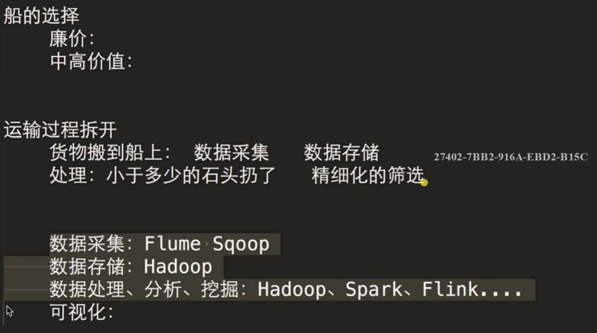
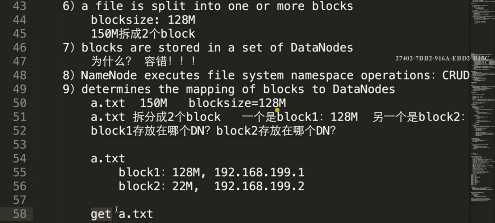
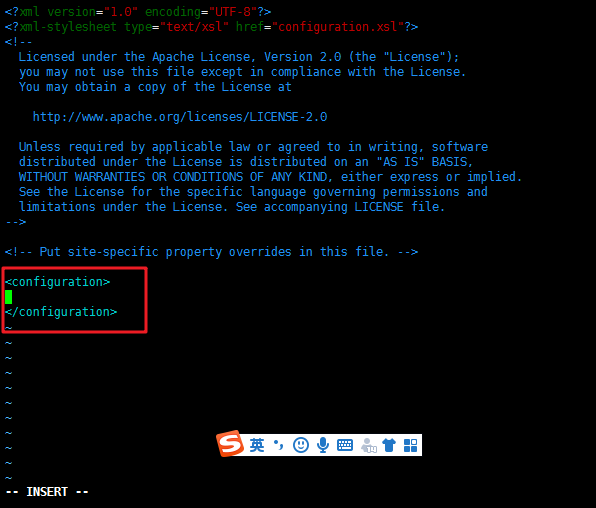
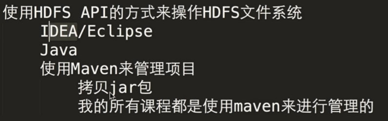
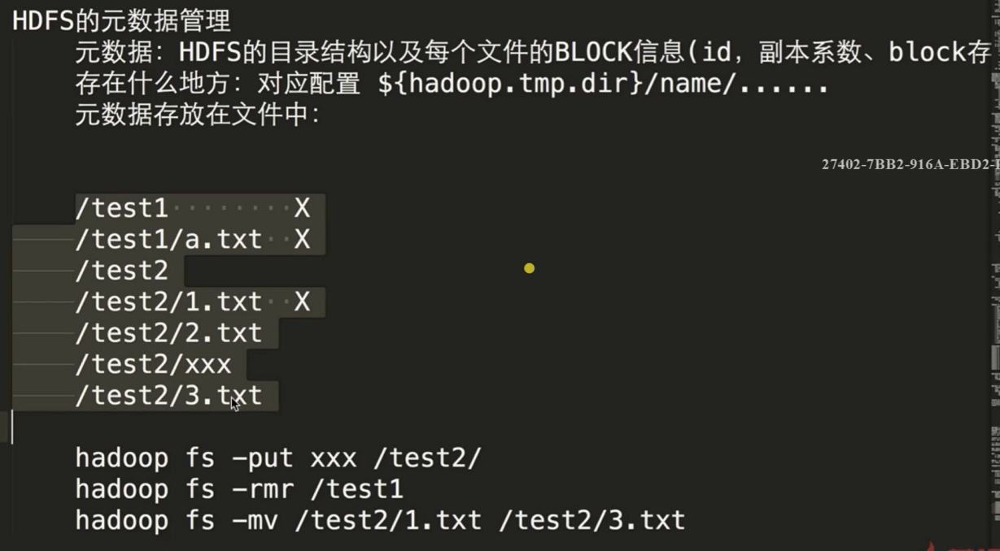
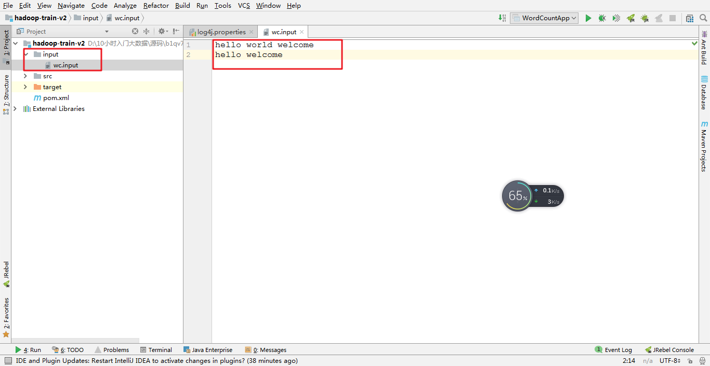
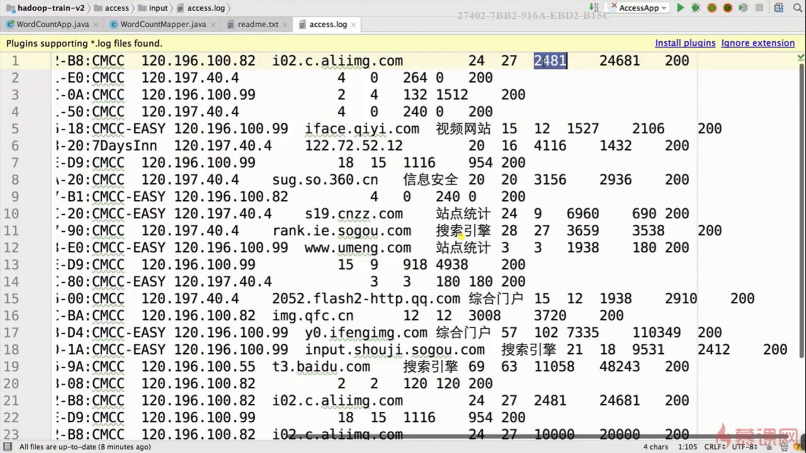
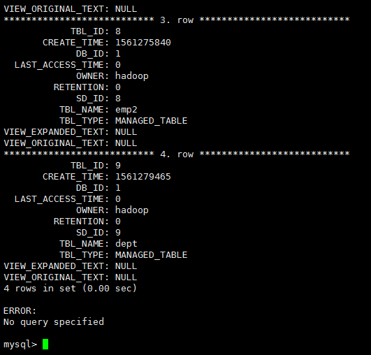

[TOC]

# 第1章 大数据概述

## 一、课程导学
### 1.生态圈


### 2.课程安排


### 3.环境参数


## 二、大数据带来的技术变革


## 三、技术概念



## 四、典型应用

==复杂度==


==时效==


# 第2章 初识Hadoop

## 一、概述


## 二、发行版选型


[CDH](https://www.cloudera.com/)

# 第3章 分布式文件系统HDFS

## 一、HDFS概述


## 二、HDFS设计目标


## 三、HDFS架构




## 四、Linux环境介绍


+ 查看系统相关信息

  ```
  uname -a
  ```

+ ip与主机名映射

  ```
  vi /etc/hosts
  ```

  

## 五 、部署前置介绍

==[CDH](http://archive.cloudera.com/cdh5/cdh/5/)==


## 六、JDK1.8部署详解

+ (1)上传`jdk-8u152-linux-x64.tar.gz`到software文件夹

+ (2)解压`jdk-8u152-linux-x64.tar.gz`

  ```
  tar -zvxf jdk-8u152-linux-x64.tar.gz -C ~/app/
  ```

  ==`~`在这里指`/home/hadoop`

+ (3)设置环境变量

  ```
  cd
  vi .bash_profile
  ```

  ==原始.bash_profile==

  ```shell
  if [ -f ~/.bashrc ]; then
           . ~/.bashrc
  fi
  
  PATH=$PATH:$HOME/.local/bin:$HOME/bin
  
  export PATH
  
  ```

  ==修改后==

  ```shell
  if [ -f ~/.bashrc ]; then
           . ~/.bashrc
  fi
  
  PATH=$PATH:$HOME/.local/bin:$HOME/bin
  
  export JAVA_HOME=/home/hadoop/app/jdk1.8.0_152
  export PATH=$JAVA_HOME/bin:$PATH
  
  export PATH
  
  ```

  ==使文件生效==

  ```
  source .bash_profile
  ```

  ==验证==

  ```
  java -version
  ```

  

## 七、ssh无密码登录

### 1.简单测试

==一开始无.ssh文件夹==

```
ssh localhost
yes
密码
```


+ 再次测试

```
ssh left-lenovo
yes
用户密码
```

> 发现每次登录都需要密码

### 2.尝试免密码登录

```
ssh-keygen -t rsa //一路回车
cd .ssh/
ls -al
```

+ 发现

  ```shell
  -rw------- 1 hadoop hadoop 1679 6月   2 21:53 id_rsa          //私钥
  -rw-r--r-- 1 hadoop hadoop  400 6月   2 21:53 id_rsa.pub      //公钥
  -rw-r--r-- 1 hadoop hadoop  444 6月   2 21:50 known_hosts
  ```

+ ==执行==

  ```
  cat id_rsa.pub >> authorized_keys
  chmod 600 authorized_keys         //修改权限
  ```

  

+ ==所遇的坑==

  ***ssh配置authorized_keys后仍然需要输入密码***

+ 解决：

  ```
  chown -R hadoop /home/hadoop
  chmod 700 /home/hadoop
  ```

  权限情况

  ```
  -rw------- 1 hadoop hadoop  400 6月   2 22:35 authorized_keys
  -rw------- 1 hadoop hadoop 1679 6月   2 22:34 id_rsa
  -rw-r--r-- 1 hadoop hadoop  400 6月   2 22:34 id_rsa.pub
  -rw-r--r-- 1 hadoop hadoop  444 6月   2 22:38 known_hosts
  ```

  

## 八、hadoop安装&hadoop-env配置

### 1.hadoop(HDFS)安装

+ 解压`hadoop-2.6.0-cdh5.15.1.tar.gz`至app

  ```
  tar -zxvf hadoop-2.6.0-cdh5.15.1.tar.gz -C ~/app/
  ```

  

  

### 2.修改hadoop-env.sh

```
cd 
cd app/hadoop-2.6.0-cdh5.15.1/
cd etc/hadoop
vi hadoop-env.sh
```


```
export JAVA_HOME=/home/hadoop/app/jdk1.8.0_152
```


## 九、HDFS格式化

### 1.core-site.xml

```
cd 
cd app/hadoop-2.6.0-cdh5.15.1/
vi etc/hadoop/core-site.xml
```


```xml
<configuration>
    <property>
        <name>fs.defaultFS</name>
        <value>hdfs://left-Lenovo:8020</value>
    </property>
</configuration>
```

### 2.hdfs-site.xml

```
cd 
cd app/hadoop-2.6.0-cdh5.15.1/
vi etc/hadoop/hdfs-site.xml
```


```xml
<configuration>
   <property>
        <name>dfs.replication</name>
        <value>1</value>
    </property>
	
	<property>
        <name>hadoop.tmp.dir</name>
        <value>/home/hadoop/app/tmp</value>
     </property>
</configuration>

```


### 3.slaves

```
cd 
cd app/hadoop-2.6.0-cdh5.15.1/
vi etc/hadoop/slaves
```


```
left-Lenovo
```

### 4.配置hadoop环境变量

```
vi ~/.bash_profile
/home/hadoop/app/hadoop-2.6.0-cdh5.15.1
```

```
export HADOOP_HOME=/home/hadoop/app/hadoop-2.6.0-cdh5.15.1
export PATH=$HADOOP_HOME/bin:$PATH
```


```
source ~/.bash_profile
```

### 5.启动HDFS

+ HDFS格式化

==第一次执行的时候一定格式化文件系统，不要重复执行==

```
cd $HADOOP_HOME/bin
hdfs namenode -format
```


+ 启动HDFS

  ```
  cd $HADOOP_HOME/sbin
  ./start-dfs.sh
  ```

  


+ 验证

  + 法一：

  ```
  jps
  ```

  ```
  7922 Jps
  7764 SecondaryNameNode
  7561 DataNode
  7454 NameNode
  ```

  + 法二：

    ```
    浏览器访问方式：http://left-lenovo:50070
     			http://192.168.123.101:50070
    ```


查看防火墙状态

```
firewall-cmd --state
```

停掉防火墙

```
systemctl stop firewalld.service
```
禁止开机启动防火墙

```
systemctl disable firewalld.service
```

### 6.停止HDFS

```
cd $HADOOP_HOME/sbin
./stop-dfs.sh
```


## 十、命令行操作

[命令](http://hadoop.apache.org/docs/current/hadoop-project-dist/hadoop-common/FileSystemShell.html)

```
hadoop fs  -...
```
1.创建文件夹

```
hadoop fs -mkdir -p /test/a/b
```
2.递归展示

```
hadoop fs -ls -R /
```
3.文件拿至本地

```
hadoop fs -get /test/a/b/h.txt
```
4.拷贝
```
hadoop fs -copyFromLocal hello.txt /test/a/b/h.txt
```
5.删除文件夹
```
hadoop fs -rm -R /test
```
6.上传文件
```
hadoop fs -put hello.txt /
```
7.读取文件

```
hadoop fs -text  /hdfsapi/test/a.txt
```
8.查看更多指令

```
hadoop fs+回车
```

9.拓展

```
hadoop fs -ls = hadoop fs -ls /user/hadoop
```


## 甲、HDFS API编程

### 1.环境搭建




+ pom.xml

  ```xml
  <?xml version="1.0" encoding="UTF-8"?>
  
  <project xmlns="http://maven.apache.org/POM/4.0.0" xmlns:xsi="http://www.w3.org/2001/XMLSchema-instance"
    xsi:schemaLocation="http://maven.apache.org/POM/4.0.0 http://maven.apache.org/xsd/maven-4.0.0.xsd">
    <modelVersion>4.0.0</modelVersion>
  
    <groupId>com.imooc.bigdata</groupId>
    <artifactId>hadoop-train-v2</artifactId>
    <version>1.0</version>
  
    <name>hadoop-train-v2</name>
    <!-- FIXME change it to the project's website -->
    <url>http://www.example.com</url>
  
    <properties>
      <project.build.sourceEncoding>UTF-8</project.build.sourceEncoding>
      <maven.compiler.source>1.7</maven.compiler.source>
      <maven.compiler.target>1.7</maven.compiler.target>
      <hadoop.version>2.6.0-cdh5.15.1</hadoop.version>
    </properties>
  
    <!--引入cdh的仓库-->
    <repositories>
      <repository>
        <id>cloudera</id>
        <url>https://repository.cloudera.com/artifactory/cloudera-repos/</url>
      </repository>
    </repositories>
  
    <dependencies>
      <!--添加Junit依赖包-->
      <dependency>
        <groupId>junit</groupId>
        <artifactId>junit</artifactId>
        <version>4.11</version>
        <scope>test</scope>
      </dependency>
      <!--引入hadoop依赖包-->
      <dependency>
        <groupId>org.apache.hadoop</groupId>
        <artifactId>hadoop-client</artifactId>
        <version>${hadoop.version}</version>
      </dependency>
    </dependencies>
  
    <build>
      <pluginManagement><!-- lock down plugins versions to avoid using Maven defaults (may be moved to parent pom) -->
        <plugins>
          <!-- clean lifecycle, see https://maven.apache.org/ref/current/maven-core/lifecycles.html#clean_Lifecycle -->
          <plugin>
            <artifactId>maven-clean-plugin</artifactId>
            <version>3.1.0</version>
          </plugin>
          <!-- default lifecycle, jar packaging: see https://maven.apache.org/ref/current/maven-core/default-bindings.html#Plugin_bindings_for_jar_packaging -->
          <plugin>
            <artifactId>maven-resources-plugin</artifactId>
            <version>3.0.2</version>
          </plugin>
          <plugin>
            <artifactId>maven-compiler-plugin</artifactId>
            <version>3.8.0</version>
          </plugin>
          <plugin>
            <artifactId>maven-surefire-plugin</artifactId>
            <version>2.22.1</version>
          </plugin>
          <plugin>
            <artifactId>maven-jar-plugin</artifactId>
            <version>3.0.2</version>
          </plugin>
          <plugin>
            <artifactId>maven-install-plugin</artifactId>
            <version>2.5.2</version>
          </plugin>
          <plugin>
            <artifactId>maven-deploy-plugin</artifactId>
            <version>2.8.2</version>
          </plugin>
          <!-- site lifecycle, see https://maven.apache.org/ref/current/maven-core/lifecycles.html#site_Lifecycle -->
          <plugin>
            <artifactId>maven-site-plugin</artifactId>
            <version>3.7.1</version>
          </plugin>
          <plugin>
            <artifactId>maven-project-info-reports-plugin</artifactId>
            <version>3.0.0</version>
          </plugin>
        </plugins>
      </pluginManagement>
    </build>
  </project>
  ```

### 2.简单demo

```java
package com.imooc.bigdata.hadoop.hdfs;

import org.apache.hadoop.conf.Configuration;
import org.apache.hadoop.fs.FileSystem;
import org.apache.hadoop.fs.Path;

import java.net.URI;


/**
 * Hadoop HDFS Java API操作
 */
public class HDFSApp {
    public static void main(String[] args) throws Exception {
        Configuration configuration = new Configuration();
        FileSystem fileSystem = FileSystem.get(new URI("hdfs://192.168.123.100:8020"),configuration);

        Path path = new Path("/hdfsjungle/123");
        boolean result = fileSystem.mkdirs(path);
        System.out.println(result);
    }
}
```

### ==3.所遇的坑==

#### (1)坑一

运行上述demo，出现下面bug

> Exception in thread "main" java.net.ConnectException: Call From YH-20180902SKEM/192.168.123.216 to ecust-Lenovo.lan:8020 failed on connection exception: java.net.ConnectException: Connection refused: no further information;

+ 分析上面这句话，发现疑点在==ecust-Lenovo.lan:8020==

  + ==ecust-Lenovo.lan:8020==的由来

    

    

+ ==解决方法==

  修改core-site.xml

  

  

```
<configuration>
    <property>
        <name>fs.defaultFS</name>
        <value>hdfs://ecust-Lenovo.lan:8020</value>
    </property>
</configuration>
```


+ 再次运行


> 没有权限，在demo加入权限

```java
package com.imooc.bigdata.hadoop.hdfs;

import org.apache.hadoop.conf.Configuration;
import org.apache.hadoop.fs.FileSystem;
import org.apache.hadoop.fs.Path;

import java.net.URI;


/**
 * Hadoop HDFS Java API操作
 */
public class HDFSApp {
    public static void main(String[] args) throws Exception {
        Configuration configuration = new Configuration();
        FileSystem fileSystem = FileSystem.get(new URI("hdfs://192.168.123.100:8020"),configuration,"hadoop");

        Path path = new Path("/hdfsjungle/123");
        boolean result = fileSystem.mkdirs(path);
        System.out.println(result);

    }

}
```


==成功==

+ 其中，URL可以写成三种形式

  ```
  hdfs://ecust-Lenovo:8020
  hdfs://ecust-Lenovo.lan:8020
  hdfs://192.168.123.100:8020
  ```

#### (2)坑二

> 肿么都搞不好，就用ip。==要想JavaAPI能用，首先要保证hadoop命令行能使用==


> 错误原因：WARN ipc.Client: Address change detected. Old: ecust-Lenovo/192.168.1.107:8020 New: ecust-Lenovo/127.0.1.1:8020

+ 解决方法

  ```
  cd $HADOOP_HOME/sbin
  ./stop-dfs.sh
  cd
  sudo vi /etc/hosts
  ```


==重启==

```
cd $HADOOP_HOME/sbin
./start-dfs.sh
```

#### (3)调试脚本

==调试过程很繁琐，可以尝试自己写脚本==

+ 修改配置文件

  ```shell
  #!/bin/bash
  cd
  source .bash_profile
  cd $HADOOP_HOME/sbin
  ./stop-dfs.sh
  cd
  cd app/hadoop-2.6.0-cdh5.15.1/
  vi etc/hadoop/core-site.xml
  ```

+ 重启

  ```shell
  #!/bin/bash
  source .bash_profile
  cd $HADOOP_HOME/sbin
  ./start-dfs.sh
  jps
  ```

+ 格式化

  ```shell
  #!/bin/bash
  cd
  source ~/.bash_profile
  rm -fr /home/hadoop/app/tmp
  cd $HADOOP_HOME/bin
  hdfs namenode -format
  echo "Y"
  cd $HADOOP_HOME/sbin
  ./start-dfs.sh
  jps
  ```

  

### 4.jUnit封装

```java
package com.imooc.bigdata.hadoop.hdfs;

import org.apache.hadoop.conf.Configuration;
import org.apache.hadoop.fs.FileSystem;
import org.apache.hadoop.fs.Path;
import org.junit.After;
import org.junit.Before;
import org.junit.Test;

import java.net.URI;


/**
 * Hadoop HDFS Java API操作
 *
 * 关键点：
 * 1）创建Configuration
 * 2）获取FileSystem
 * 3）。。。就是HDFS API的操作
 */
public class HDFSApp {

    FileSystem fileSystem = null;
    Configuration configuration = null;

    /**
     * HDFS的路径,core-site.xml中配置的端口号
     */
    public static final String HDFS_PATH = "hdfs://192.168.123.100:8020";
    /**
     * 解决无权限访问,设置远程hadoop的linux用户名称
     */
    public static final String USER = "hadoop";

    /**
     * 单元测试之前的准备工作,准备环境,加载配置
     *
     * @throws Exception
     */
    @Before
    public void setUp() throws Exception {

        System.out.println("HDFSApp is setUp.....");
        configuration = new Configuration();
        /**
         * 构造一个访问指定HDFS系统的客户端对象
         * 第一个参数：HDFS的URI
         * 第二个参数：客户端指定的配置参数
         * 第三个参数：客户端的身份，说白了就是用户名
         */
        fileSystem = FileSystem.get(new URI(HDFS_PATH), configuration, USER);

    }

    /**
     * 创建目录
     *
     * @throws Exception
     */
    @Test
    public void mkDir() throws Exception {
        fileSystem.mkdirs(new Path("/hdfstest/456"));
    }

    /**
     * 单元测试之后的工作,清理环境,释放资源等等
     *
     * @throws Exception
     */
    @After
    public void tearDown() throws Exception {
        configuration = null;
        fileSystem = null;
        System.out.println("HDFSApp is tearDown....");
    }


//    public static void main(String[] args) throws Exception {
//        Configuration configuration = new Configuration();
//        FileSystem fileSystem = FileSystem.get(new URI("hdfs://ecust-Lenovo.lan:8020"),configuration,"hadoop");
//
//        Path path = new Path("/hdfsjungle/123/2/3");
//        boolean result = fileSystem.mkdirs(path);
//        System.out.println(result);
//
//    }

}
```

### 5.API编程相关操作

```java
package com.imooc.bigdata.hadoop.hdfs;

import org.apache.hadoop.conf.Configuration;
import org.apache.hadoop.fs.*;
import org.apache.hadoop.io.IOUtils;
import org.apache.hadoop.util.Progressable;
import org.junit.After;
import org.junit.Before;
import org.junit.Test;

import java.io.BufferedInputStream;
import java.io.File;
import java.io.FileInputStream;
import java.io.InputStream;
import java.net.URI;


/**
 * Hadoop HDFS Java API操作
 *
 * 关键点：
 * 1）创建Configuration
 * 2）获取FileSystem
 * 3）。。。就是HDFS API的操作
 */
public class HDFSApp {

    FileSystem fileSystem = null;
    Configuration configuration = null;

    /**
     * HDFS的路径,core-site.xml中配置的端口号
     */
    public static final String HDFS_PATH = "hdfs://192.168.123.100:8020";
    /**
     * 解决无权限访问,设置远程hadoop的linux用户名称
     */
    public static final String USER = "hadoop";

    /**
     * 单元测试之前的准备工作,准备环境,加载配置
     *
     * @throws Exception
     */
    @Before
    public void setUp() throws Exception {

        System.out.println("HDFSApp is setUp.....");
        configuration = new Configuration();
        //设置副本系数为1，不设置默认为3
        configuration.set("dfs.replication","1");
        /**
         * 构造一个访问指定HDFS系统的客户端对象
         * 第一个参数：HDFS的URI
         * 第二个参数：客户端指定的配置参数
         * 第三个参数：客户端的身份，说白了就是用户名
         */
        fileSystem = FileSystem.get(new URI(HDFS_PATH), configuration, USER);

    }

    /**
     * 创建目录
     *
     * @throws Exception
     */
    @Test
    public void mkDir() throws Exception {
        fileSystem.mkdirs(new Path("/hdfstest/456"));
    }

    /**
     * 查看HDFS内容
     */
    @Test
    public void text()throws Exception{
        FSDataInputStream in = fileSystem.open(new Path("/hdfstest/456/start-dfs.sh"));

        IOUtils.copyBytes(in,System.out,1024);//System.out输出至控制台
    }

    /**
     * 创建文件
     * @throws Exception
     */
    @Test
    public void create() throws Exception{
        FSDataOutputStream out = fileSystem.create(new Path("/hdfsapi/test/b.txt"));

        out.writeUTF("HELLO JUNGLE");
        out.flush();
        out.close();
    }

    /**
     * 重命名
     * @throws Exception
     */
    @Test
    public void rename() throws Exception{
        Path oldPath = new Path("/hdfsapi/test/b.txt");
        Path newPath = new Path("/hdfsapi/test/c.txt");
        boolean result = fileSystem.rename(oldPath,newPath);
        System.out.println(result);

    }

    /**
     * 拷贝本地文件到HDFS文件系统
     * @throws Exception
     */
    @Test
    public void copyFromLocalFile() throws Exception{
        Path src = new Path("pom.xml");
        Path dst = new Path("/hdfsapi/test");
        fileSystem.copyFromLocalFile(src,dst);
    }

    /**
     * 拷贝本地大文件到HDFS文件系统：带进度
     * @throws Exception
     */
    @Test
    public void copyFromLocalBigFile() throws Exception{
        InputStream in = new BufferedInputStream(new FileInputStream(new File("jdk-8u152-linux-x64.tar.gz")));
        FSDataOutputStream out = fileSystem.create(new Path("/hdfsapi/test/jdk.tgz"),
                new Progressable() {
                    @Override
                    public void progress() {
                        System.out.print(".");
                    }
                });
        IOUtils.copyBytes(in,out,4096);
        Path src = new Path("jdk-8u152-linux-x64.tar.gz");
        Path dst = new Path("/hdfsapi/test/");
        fileSystem.copyFromLocalFile(src,dst);
    }

    /**
     * 拷贝HDFS文件到本地：下载
     * @throws Exception
     */
    @Test
    public void copyToLocalFile() throws Exception{
        Path src = new Path("/hdfstest/456/start-dfs.sh");
        Path dst = new Path("D:/10小时入门大数据/源码/b1qv7n/hadoop-train-v2");
        //第一个参数是是否删除掉源目录
        //最后一个参数是是否使用本地文件系统，改用java的io流
        fileSystem.copyToLocalFile(false,src,dst,true);
    }

    /**
     * 查看目标文件夹下的所有文件
     * @throws Exception
     */
    @Test
    public void listFiles() throws Exception{
        FileStatus[] statuses = fileSystem.listStatus(new Path("/hdfsapi/test"));
        for (FileStatus file:statuses) {
            String isDir = file.isDirectory()?"文件夹":"文件";
            String permission = file.getOwner().toString();
            short replication = file.getReplication();
            long length = file.getLen();
            String path = file.getPath().toString();
            System.out.println(isDir+"\t"+permission+"\t"+replication+"\t"+length+"\t"+path);
        }
    }

    /**
     * 递归查看目标文件夹下的所有文件
     * @throws Exception
     */
    @Test
    public void listFilesRecursive() throws Exception{
        RemoteIterator<LocatedFileStatus> files = fileSystem.listFiles(new Path("/hdfsapi/test"),true);
        while (files.hasNext()){
            LocatedFileStatus file = files.next();
            String isDir = file.isDirectory()?"文件夹":"文件";
            String permission = file.getOwner().toString();
            short replication = file.getReplication();
            long length = file.getLen();
            String path = file.getPath().toString();
            System.out.println(isDir+"\t"+permission+"\t"+replication+"\t"+length+"\t"+path);
        }

    }
    /**
     * 查看文件块信息
     *
     */
    @Test
    public void getFileBlockLocations() throws Exception{
        FileStatus fileStatus = fileSystem.getFileStatus(new Path("/hdfsapi/test/jdk.tgz"));
        BlockLocation[] blocks = fileSystem.getFileBlockLocations(fileStatus,0,fileStatus.getLen());
        for (BlockLocation block:blocks) {
            for (String name:block.getNames()){
                System.out.println(name+":"+block.getOffset()+":"+block.getLength());
            }
            
        }
    }

    @Test
    public void delete() throws Exception{
        boolean result = fileSystem.delete(new Path("/hdfsapi/test/jdk.tgz"),true);

        System.out.println(result);
    }

    /**
     * 单元测试之后的工作,清理环境,释放资源等等
     *
     * @throws Exception
     */
    @After
    public void tearDown() throws Exception {
        configuration = null;
        fileSystem = null;
        System.out.println("HDFSApp is tearDown....");
    }


//    public static void main(String[] args) throws Exception {
//        Configuration configuration = new Configuration();
//        FileSystem fileSystem = FileSystem.get(new URI("hdfs://ecust-Lenovo.lan:8020"),configuration,"hadoop");
//
//        Path path = new Path("/hdfsjungle/123/2/3");
//        boolean result = fileSystem.mkdirs(path);
//        System.out.println(result);
//
//    }

}
```

## 乙、HDFS项目实战

==测试文件==

+ hello.txt

  ```
  hello world welcome
  hello welcome
  ```

### 1.代码框架

```java
package com.imooc.bigdata.hadoop.hdfs;

import org.apache.hadoop.conf.Configuration;
import org.apache.hadoop.fs.*;

import java.io.BufferedReader;
import java.io.InputStreamReader;
import java.net.URI;
import java.net.URISyntaxException;
import java.util.HashMap;
import java.util.Map;
import java.util.Set;

/**
 * 使用HDFS API完成Wordcount统计
 *
 * 需求：统计HDFS上的文件的wc,然后将统计结果输出到HDFS
 *
 * 功能拆解：
 * 1)读取HDFS上的文件 ==> HDFS API
 * 2)业务处理（词频统计）：对文件中每一行数据都要进行业务处理（按照分隔符分割）==>Mapper
 * 3)将处理结果缓存起来 ==>Context
 * 4)将结果输出到HDFS ==>HDFS API
 */
public class HDFSWCApp01 {
    public static void main(String[] args) throws Exception {
        // 1)读取HDFS上的文件 ==> HDFS API
        Path input = new Path("/hdfsapi/test/hello.txt");

        //获取要操作的HDFS文件系统
        FileSystem fs = FileSystem.get(new URI("hdfs://ecust-Lenovo:8020"),new Configuration(),"hadoop");


        RemoteIterator<LocatedFileStatus> iterator = fs.listFiles(input,false);

        while (iterator.hasNext()){
            LocatedFileStatus file = iterator.next();
            FSDataInputStream in = fs.open(file.getPath());
            BufferedReader reader = new BufferedReader(new InputStreamReader(in));
            String line = "";
            while ((line = reader.readLine())!=null){
                //业务处理（词频统计）
            }
            reader.close();
            in.close();
        }

        //TODO... 3)将处理结果缓存起来 Map
        Map<Object,Object> contextMap = new HashMap<Object,Object>();

        // 4)将结果输出到HDFS ==>HDFS API
        Path output = new Path("/hdfsapi/output/");
        FSDataOutputStream out = fs.create(new Path(output,new Path("wc.out")));

        //TODO... 将第三步缓存中的内容输出到out中去
        Set<Map.Entry<Object,Object>> entries = contextMap.entrySet();
        for (Map.Entry<Object,Object> entry : entries){
            out.write((entry.getKey().toString()+"\t"+entry.getValue()+"\n").getBytes());
        }

        out.close();
        fs.close();
        System.out.println("");
    }
}

```

### 2.自定义上下文

#### (1)ImoocContext类

```java
package com.imooc.bigdata.hadoop.hdfs;

import java.util.HashMap;
import java.util.Map;

/**
 * 自定义上下文，其实就是缓存
 */
public class ImoocContext {

    private Map<Object,Object> cacheMap = new HashMap<>();

    public Map<Object,Object> getCacheMap(){
        return cacheMap;
    }
    /**
     * 写数据到缓存中去
     * @param key 单词
     * @param value 次数
     */

    public void write(Object key,Object value){
        cacheMap.put(key,value);
    }

    /**
     * 从缓存中获取值
     * @param key 单词
     * @return  单词对应的词频
     */
    public Object get(Object key){
        return cacheMap.get(key);
    }
}

```

#### (2)HDFSWCApp01相应的变化

```java
                //TODO... 在业务逻辑完之后将结果写到Cache中去
            }
            reader.close();
            in.close();
        }

        //TODO... 3)将处理结果缓存起来 Map
        ImoocContext context = new ImoocContext();
        Map<Object,Object> contextMap = context.getCacheMap();
```

### 3.自定义处理类实现

#### (1)自定义Mapper

==ImoocMapper接口==

```java
package com.imooc.bigdata.hadoop.hdfs;

/**
 * 自定义Mapper
 */
public interface ImoocMapper {
    /**
     *
     * @param line 读取到每一行数据
     * @param context 上下文/缓存
     */
    public void map(String line,ImoocContext context);
}

```

#### (2)自定义wc实现类

```java
package com.imooc.bigdata.hadoop.hdfs;

/**
 * 自定义wc实现类
 */
public class WordCountMapper implements ImoocMapper {

    @Override
    public void map(String line, ImoocContext context) {
        String[] words = line.split(" ");
        for (String word:words) {
            Object value = context.get(word);
            if (value == null){//表示没有出现过该单词
                context.write(word,1);
            }else {
                //Integer.parseInt() 返回的是一个int的值。
                int v = Integer.parseInt(value.toString());
                context.write(word,v+1);//取出单词对应的次数+1
            }
            
        }
    }
}
```

### 4.功能实现

```java
package com.imooc.bigdata.hadoop.hdfs;

import org.apache.hadoop.conf.Configuration;
import org.apache.hadoop.fs.*;

import java.io.BufferedReader;
import java.io.InputStreamReader;
import java.net.URI;
import java.net.URISyntaxException;
import java.util.HashMap;
import java.util.Map;
import java.util.Set;

/**
 * 使用HDFS API完成Wordcount统计
 *
 * 需求：统计HDFS上的文件的wc,然后将统计结果输出到HDFS
 *
 * 功能拆解：
 * 1)读取HDFS上的文件 ==> HDFS API
 * 2)业务处理（词频统计）：对文件中每一行数据都要进行业务处理（按照分隔符分割）==>Mapper
 * 3)将处理结果缓存起来 ==>Context
 * 4)将结果输出到HDFS ==>HDFS API
 */
public class HDFSWCApp01 {
    public static void main(String[] args) throws Exception {
        // 1)读取HDFS上的文件 ==> HDFS API
        Path input = new Path("/hello.txt");

        //获取要操作的HDFS文件系统
        FileSystem fs = FileSystem.get(new URI("hdfs://ecust-Lenovo:8020"),new Configuration(),"hadoop");


        RemoteIterator<LocatedFileStatus> iterator = fs.listFiles(input,false);

        ImoocMapper mapper = new WordCountMapper();
        ImoocContext context = new ImoocContext();

        while (iterator.hasNext()){
            LocatedFileStatus file = iterator.next();
            FSDataInputStream in = fs.open(file.getPath());
            BufferedReader reader = new BufferedReader(new InputStreamReader(in));
            String line = "";
            while ((line = reader.readLine())!=null){
                //z) 业务处理（词频统计）（hello,3)

                //TODO... 在业务逻辑完之后将结果写到Cache中去
                mapper.map(line,context);
            }
            reader.close();
            in.close();
        }

        //TODO... 3)将处理结果缓存起来 Map

        Map<Object,Object> contextMap = context.getCacheMap();

        // 4)将结果输出到HDFS ==>HDFS API
        Path output = new Path("/hdfsapi/output/");
        FSDataOutputStream out = fs.create(new Path(output,new Path("wc.out")));

        //TODO... 将第三步缓存中的内容输出到out中去
        Set<Map.Entry<Object,Object>> entries = contextMap.entrySet();
        for (Map.Entry<Object,Object> entry : entries){
            out.write((entry.getKey().toString()+"\t"+entry.getValue()+"\n").getBytes());
        }

        out.close();
        fs.close();
        System.out.println("运行成功");
    }
}

```

==结果==

### 5.自定义配置文件重构代码


#### (1)wc.properties

```properties
INPUT_PATH=/hello.txt
OUTPUT_PATH=/hdfsapi/output/
OUTPUT_FILE=wc.out3
HDFS_URI=hdfs://ecust-Lenovo:8020
```

#### (2)ParamsUtils

```java
package com.imooc.bigdata.hadoop.hdfs;


import java.io.IOException;
import java.util.Properties;

/**
 * 读取属性配置文件
 */
public class ParamsUtils {

    private static Properties properties = new Properties();
    static {
        try {
            properties.load(ParamsUtils.class.getClassLoader().getResourceAsStream("wc.properties"));
        } catch (IOException e) {
            e.printStackTrace();
        }
    }
    public static Properties getProperties() throws Exception{
        return properties;
    }

    public static void main(String[] args) throws Exception {
        System.out.println(getProperties().getProperty("INPUT_PATH"));
    }
}

```

#### (3)Constants.java

```java
package com.imooc.bigdata.hadoop.hdfs;

/**
 * 常量
 */
public class Constants {
    public static final String INPUT_PATH="INPUT_PATH";
    public static final String OUTPUT_PATH="OUTPUT_PATH";
    public static final String OUTPUT_FILE="OUTPUT_FILE";
    public static final String HDFS_URI="HDFS_URI";
}

```

#### (4)HDFSWCApp02

```java
package com.imooc.bigdata.hadoop.hdfs;

import org.apache.hadoop.conf.Configuration;
import org.apache.hadoop.fs.*;

import java.io.BufferedReader;
import java.io.InputStreamReader;
import java.net.URI;
import java.util.Map;
import java.util.Properties;
import java.util.Set;

/**
 * 使用HDFS API完成Wordcount统计
 *
 * 需求：统计HDFS上的文件的wc,然后将统计结果输出到HDFS
 *
 * 功能拆解：
 * 1)读取HDFS上的文件 ==> HDFS API
 * 2)业务处理（词频统计）：对文件中每一行数据都要进行业务处理（按照分隔符分割）==>Mapper
 * 3)将处理结果缓存起来 ==>Context
 * 4)将结果输出到HDFS ==>HDFS API
 */
public class HDFSWCApp02 {
    public static void main(String[] args) throws Exception {
        // 1)读取HDFS上的文件 ==> HDFS API

        Properties properties = ParamsUtils.getProperties();
        Path input = new Path(properties.getProperty(Constants.INPUT_PATH));

        //获取要操作的HDFS文件系统
        FileSystem fs = FileSystem.get(new URI(properties.getProperty(Constants.HDFS_URI)),new Configuration(),"hadoop");


        RemoteIterator<LocatedFileStatus> iterator = fs.listFiles(input,false);

        ImoocMapper mapper = new WordCountMapper();
        ImoocContext context = new ImoocContext();

        while (iterator.hasNext()){
            LocatedFileStatus file = iterator.next();
            FSDataInputStream in = fs.open(file.getPath());
            BufferedReader reader = new BufferedReader(new InputStreamReader(in));
            String line = "";
            while ((line = reader.readLine())!=null){
                //z) 业务处理（词频统计）（hello,3)

                //TODO... 在业务逻辑完之后将结果写到Cache中去
                mapper.map(line,context);
            }
            reader.close();
            in.close();
        }

        //TODO... 3)将处理结果缓存起来 Map

        Map<Object,Object> contextMap = context.getCacheMap();

        // 4)将结果输出到HDFS ==>HDFS API
        Path output = new Path(properties.getProperty(Constants.OUTPUT_PATH));
        FSDataOutputStream out = fs.create(new Path(output,new Path(properties.getProperty(Constants.OUTPUT_FILE))));

        //TODO... 将第三步缓存中的内容输出到out中去
        Set<Map.Entry<Object,Object>> entries = contextMap.entrySet();
        for (Map.Entry<Object,Object> entry : entries){
            out.write((entry.getKey().toString()+"\t"+entry.getValue()+"\n").getBytes());
        }

        out.close();
        fs.close();
        System.out.println("运行成功");
    }
}

```

### 6.反射自定义Mapper对象

#### (1)wc.properties

```properties
INPUT_PATH=/hello.txt
OUTPUT_PATH=/hdfsapi/output/
OUTPUT_FILE=wc.out4
HDFS_URI=hdfs://ecust-Lenovo:8020
MAPPER_CLASS=com.imooc.bigdata.hadoop.hdfs.WordCountMapper
```


#### (2)Constants.java

```java
package com.imooc.bigdata.hadoop.hdfs;

/**
 * 常量
 */
public class Constants {
    public static final String INPUT_PATH="INPUT_PATH";
    public static final String OUTPUT_PATH="OUTPUT_PATH";
    public static final String OUTPUT_FILE="OUTPUT_FILE";
    public static final String HDFS_URI="HDFS_URI";
    public static final String MAPPER_CLASS="MAPPER_CLASS";
}
```

#### (3)HDFSWCApp02


```java
package com.imooc.bigdata.hadoop.hdfs;

import org.apache.hadoop.conf.Configuration;
import org.apache.hadoop.fs.*;

import java.io.BufferedReader;
import java.io.InputStreamReader;
import java.net.URI;
import java.util.Map;
import java.util.Properties;
import java.util.Set;

/**
 * 使用HDFS API完成Wordcount统计
 *
 * 需求：统计HDFS上的文件的wc,然后将统计结果输出到HDFS
 *
 * 功能拆解：
 * 1)读取HDFS上的文件 ==> HDFS API
 * 2)业务处理（词频统计）：对文件中每一行数据都要进行业务处理（按照分隔符分割）==>Mapper
 * 3)将处理结果缓存起来 ==>Context
 * 4)将结果输出到HDFS ==>HDFS API
 */
public class HDFSWCApp02 {
    public static void main(String[] args) throws Exception {
        // 1)读取HDFS上的文件 ==> HDFS API

        Properties properties = ParamsUtils.getProperties();
        Path input = new Path(properties.getProperty(Constants.INPUT_PATH));

        //获取要操作的HDFS文件系统
        FileSystem fs = FileSystem.get(new URI(properties.getProperty(Constants.HDFS_URI)),new Configuration(),"hadoop");


        RemoteIterator<LocatedFileStatus> iterator = fs.listFiles(input,false);

        //TODO... 通过反射创建对象
        Class<?> clazz = Class.forName(properties.getProperty(Constants.MAPPER_CLASS));
        ImoocMapper mapper = (ImoocMapper) clazz.newInstance();
//        ImoocMapper mapper = new WordCountMapper();
        ImoocContext context = new ImoocContext();

        while (iterator.hasNext()){
            LocatedFileStatus file = iterator.next();
            FSDataInputStream in = fs.open(file.getPath());
            BufferedReader reader = new BufferedReader(new InputStreamReader(in));
            String line = "";
            while ((line = reader.readLine())!=null){
                //z) 业务处理（词频统计）（hello,3)

                //TODO... 在业务逻辑完之后将结果写到Cache中去
                mapper.map(line,context);
            }
            reader.close();
            in.close();
        }

        //TODO... 3)将处理结果缓存起来 Map

        Map<Object,Object> contextMap = context.getCacheMap();

        // 4)将结果输出到HDFS ==>HDFS API
        Path output = new Path(properties.getProperty(Constants.OUTPUT_PATH));
        FSDataOutputStream out = fs.create(new Path(output,new Path(properties.getProperty(Constants.OUTPUT_FILE))));

        //TODO... 将第三步缓存中的内容输出到out中去
        Set<Map.Entry<Object,Object>> entries = contextMap.entrySet();
        for (Map.Entry<Object,Object> entry : entries){
            out.write((entry.getKey().toString()+"\t"+entry.getValue()+"\n").getBytes());
        }

        out.close();
        fs.close();
        System.out.println("运行成功");
    }
}
```

### 7.可插拔业务逻辑处理

==忽略大小写==

+ 测试文件h.txt

```
hello world welcome
Hello Welcome
```

#### (1)自定义Mapper实现类

==根据业务需要，重新定义一个mapper实现类==

+ CaseIgnoreWordCountMapper

  ```java
  package com.imooc.bigdata.hadoop.hdfs;
  
  /**
   * 自定义wc实现类
   */
  public class CaseIgnoreWordCountMapper implements ImoocMapper {
  
      @Override
      public void map(String line, ImoocContext context) {
          String[] words = line.toLowerCase().split(" ");
          for (String word:words) {
              Object value = context.get(word);
              if (value == null){//表示没有出现过该单词
                  context.write(word,1);
              }else {
                  //Integer.parseInt() 返回的是一个int的值。
                  int v = Integer.parseInt(value.toString());
                  context.write(word,v+1);//取出单词对应的次数+1
              }
              
          }
      }
  }
  
  ```

  

#### (2)wc.properties

```properties
INPUT_PATH=/hdfsapi/test/h.txt
OUTPUT_PATH=/hdfsapi/output/
OUTPUT_FILE=wc.out6
HDFS_URI=hdfs://ecust-Lenovo:8020
MAPPER_CLASS=com.imooc.bigdata.hadoop.hdfs.CaseIgnoreWordCountMapper
```

  

==运行HDFSWCApp02==

> 结果


## 丁、副本摆放策略


## 戊、HDFS写数据


## 己、HDFS读数据


## 庚、Checkpoint详解




# 第4章 分布式计算框架MapReduce

## 一、MapReduce编程模型

==wordcount词频统计分析案例入门==


## 二、词频统计实战

### 1.自定义Mapper实现


```java
package com.imooc.bigdata.hadoop.mr.wc;

import org.apache.hadoop.io.IntWritable;
import org.apache.hadoop.io.LongWritable;
import org.apache.hadoop.io.Text;
import org.apache.hadoop.mapreduce.Mapper;

import java.io.IOException;

/**
 * KEYIN:Map任务读数据的key类型，offset,是每行数据起始位置的偏移量，Long
 * VALUEIN:Map任务读数据的value类型，其实就是一行行的字符串，String
 *
 * hello world welcome
 * hello welcome
 *
 * KEYOUT：map方法自定义实现输出的key的类型，String
 * VALUEOUT:map方法自定义实现输出的value的类型，Integer
 *
 * 词频统计：相同单词的次数 （Word ，1）
 *
 * Long，String，String，Integer是Java里面的数据类型
 * Hadoop自定义类型：序列化和反序列化
 *
 * LongWritable,Text,Text,IntWritable
 */
public class WordCountMapper extends Mapper<LongWritable,Text,Text,IntWritable> {

    @Override
    protected void map(LongWritable key, Text value, Context context) throws IOException, InterruptedException {

        //把value对应的行数据按照指定的分隔符拆开
        String[] words = value.toString().split(" ");

        for (String word:words) {
            // (hello,1) (world,1)
            context.write(new Text(word),new IntWritable(1));
            
        }
    }
}
```

### 2.自定义Reduce实现


```java
package com.imooc.bigdata.hadoop.mr.wc;

import org.apache.hadoop.io.IntWritable;
import org.apache.hadoop.io.Text;
import org.apache.hadoop.mapreduce.Reducer;

import java.io.IOException;
import java.util.Iterator;

public class WordCountReduce extends Reducer<Text,IntWritable,Text,IntWritable> {

    /**
     *(hello,1) (world,1)
     * (hello,1) (world,1)
     * (hello,1) (world,1)
     * (welcome,1)
     *
     * map的输出到reduce端，是按照相同的key分发到一个reduce上去执行
     *
     * reduce1:(hello,1)(hello,1)(hello,1)==>(hello,<1,1,1>)
     * reduce2:(hello,1)(hello,1)(hello,1)==>(word,<1,1,1>)
     * reduce3:(welcome,1)==>(welcome,<1>)
     *
     * Reduce和Mapper中其实使用了什么设计模式：模板
     */

    @Override
    protected void reduce(Text key, Iterable<IntWritable> values, Context context) throws IOException, InterruptedException {

        int count = 0;
        Iterator<IntWritable> iterator = values.iterator();

        //<1,1,1>
        while (iterator.hasNext()){
            IntWritable value = iterator.next();
            count += value.get();
        }
        context.write(key,new IntWritable(count));
    }
}

```

### 3.自定义Driver类实现

#### (1)Driver类

```java
package com.imooc.bigdata.hadoop.mr.wc;

import org.apache.hadoop.conf.Configuration;
import org.apache.hadoop.fs.FileSystem;
import org.apache.hadoop.fs.Path;
import org.apache.hadoop.io.IntWritable;
import org.apache.hadoop.io.Text;
import org.apache.hadoop.mapreduce.Job;
import org.apache.hadoop.mapreduce.lib.input.FileInputFormat;
import org.apache.hadoop.mapreduce.lib.output.FileOutputFormat;

import java.net.URI;

/**
 * 使用MR统计HDFS上的文件对应的词频
 *
 * Driver:配置Mapper,Reducer的相关属性
 *
 * 提交到本地运行：开发过程中使用
 */
public class WordCountApp {
    public static void main(String[] args) throws Exception {

        System.setProperty("HADOOP_USER_NAME","hadoop");
        Configuration configuration = new Configuration();
        configuration.set("fs.defaultFS","hdfs://ecust-Lenovo:8020");
        //创建一个Job
        Job job = Job.getInstance(configuration);

        //设置Job对应的参数：主类
        job.setJarByClass(WordCountApp.class);

        //设置Job对应的参数:设置自定义的Mapper和Reduce处理类
        job.setMapperClass(WordCountMapper.class);
        job.setReducerClass(WordCountReduce.class);

        //设置Job对应的参数：Mapper输出key和value的类型
        job.setMapOutputKeyClass(Text.class);
        job.setMapOutputValueClass(IntWritable.class);

        //设置Job对应的参数：Reduce输出key和value的类型
        job.setOutputKeyClass(Text.class);
        job.setOutputValueClass(IntWritable.class);

        //如果输出目录已经存在，则先删除
        FileSystem fileSystem = FileSystem.get(new URI("hdfs://ecust-Lenovo:8020"),configuration);
        Path outputPath = new Path("/wordcount/output");
        if (fileSystem.exists(outputPath)){
            fileSystem.delete(outputPath,true);
        }


        //设置Job对应的参数：作业输入和输出路径
        FileInputFormat.setInputPaths(job, new Path("/wordcount/input"));
        FileOutputFormat.setOutputPath(job,outputPath);

        //提交job
        boolean result = job.waitForCompletion(true);
        System.exit(result?0:-1);

    }
}
```

==所遇的坑==

>  Windows报Failed to locate the winutils binary in the hadoop binary path，java.io.IOException:

+ [未解决](<https://blog.csdn.net/xiaoduan_/article/details/79476815>)

#### (2)日志

==通过日志查看错误==


```properties
log4j.rootLogger=INFO,stdout

log4j.appender.stdout=org.apache.log4j.ConsoleAppender
log4j.appender.stdout.Target=System.out
log4j.appender.stdout.layout=org.apache.log4j.PatternLayout
log4j.appender.stdout.layout.ConversionPattern=[%-5p] method:%l%n%m%n
```

### 4.本地方式运行

#### (1)本地数据

#### (2)WordCountLocalApp


```java
package com.imooc.bigdata.hadoop.mr.wc;

import org.apache.hadoop.conf.Configuration;
import org.apache.hadoop.fs.Path;
import org.apache.hadoop.io.IntWritable;
import org.apache.hadoop.io.Text;
import org.apache.hadoop.mapreduce.Job;
import org.apache.hadoop.mapreduce.lib.input.FileInputFormat;
import org.apache.hadoop.mapreduce.lib.output.FileOutputFormat;

/**
 * 使用MR统计HDFS上的文件对应的词频
 *
 * 使用本地文件进行统计，然后统计结果输出到本地路径
 */
public class WordCountLocalApp {
    public static void main(String[] args) throws Exception {

        Configuration configuration = new Configuration();
        //创建一个Job
        Job job = Job.getInstance(configuration);

        //设置Job对应的参数：主类
        job.setJarByClass(WordCountLocalApp.class);

        //设置Job对应的参数:设置自定义的Mapper和Reduce处理类
        job.setMapperClass(WordCountMapper.class);
        job.setReducerClass(WordCountReduce.class);

        //设置Job对应的参数：Mapper输出key和value的类型
        job.setMapOutputKeyClass(Text.class);
        job.setMapOutputValueClass(IntWritable.class);

        //设置Job对应的参数：Reduce输出key和value的类型
        job.setOutputKeyClass(Text.class);
        job.setOutputValueClass(IntWritable.class);

        //设置Job对应的参数：作业输入和输出路径
        FileInputFormat.setInputPaths(job, new Path("input"));
        FileOutputFormat.setOutputPath(job, new Path("output"));

        //提交job
        boolean result = job.waitForCompletion(true);
        System.exit(result?0:-1);

    }
}
```

### 5.忽略大小写

+ CaseIgnoreWordCountMapper

  

  ```java
  package com.imooc.bigdata.hadoop.mr.wc;
  
  import org.apache.hadoop.io.IntWritable;
  import org.apache.hadoop.io.LongWritable;
  import org.apache.hadoop.io.Text;
  import org.apache.hadoop.mapreduce.Mapper;
  
  import java.io.IOException;
  
  /**
   * KEYIN:Map任务读数据的key类型，offset,是每行数据起始位置的偏移量，Long
   * VALUEIN:Map任务读数据的value类型，其实就是一行行的字符串，String
   *
   * hello world welcome
   * hello welcome
   *
   * KEYOUT：map方法自定义实现输出的key的类型，String
   * VALUEOUT:map方法自定义实现输出的value的类型，Integer
   *
   * 词频统计：相同单词的次数 （Word ，1）
   *
   * Long，String，String，Integer是Java里面的数据类型
   * Hadoop自定义类型：序列化和反序列化
   *
   * LongWritable,Text,Text,IntWritable
   */
  public class WordCountMapper extends Mapper<LongWritable,Text,Text,IntWritable> {
  
      @Override
      protected void map(LongWritable key, Text value, Context context) throws IOException, InterruptedException {
  
          //把value对应的行数据按照指定的分隔符拆开
          String[] words = value.toString().split(" ");
  
          for (String word:words) {
              // (hello,1) (world,1)
              context.write(new Text(word.toLowerCase()),new IntWritable(1));
  
          }
      }
  }
  
  ```

### 6.Combiner操作


  

```java
package com.imooc.bigdata.hadoop.mr.wc;

import org.apache.hadoop.conf.Configuration;
import org.apache.hadoop.fs.Path;
import org.apache.hadoop.io.IntWritable;
import org.apache.hadoop.io.Text;
import org.apache.hadoop.mapreduce.Job;
import org.apache.hadoop.mapreduce.lib.input.FileInputFormat;
import org.apache.hadoop.mapreduce.lib.output.FileOutputFormat;

/**
 *  Combiner操作
 */
public class WordCountCombinerLocalApp {

    public static void main(String[] args) throws Exception {

        Configuration configuration = new Configuration();
        //创建一个Job
        Job job = Job.getInstance(configuration);

        //设置Job对应的参数：主类
        job.setJarByClass(WordCountCombinerLocalApp.class);

        //设置Job对应的参数:设置自定义的Mapper和Reduce处理类
        job.setMapperClass(WordCountMapper.class);
        job.setReducerClass(WordCountReduce.class);

        //添加Combiner的设置即可
        job.setCombinerClass(WordCountReduce.class);
        
        //设置Job对应的参数：Mapper输出key和value的类型
        job.setMapOutputKeyClass(Text.class);
        job.setMapOutputValueClass(IntWritable.class);

        //设置Job对应的参数：Reduce输出key和value的类型
        job.setOutputKeyClass(Text.class);
        job.setOutputValueClass(IntWritable.class);

        //设置Job对应的参数：作业输入和输出路径
        FileInputFormat.setInputPaths(job, new Path("input"));
        FileOutputFormat.setOutputPath(job, new Path("output"));

        //提交job
        boolean result = job.waitForCompletion(true);
        System.exit(result?0:-1);

    }
}
```

## 三、流量统计实战


+ readme.txt

```
自定义复杂类型

access.log
    第二个字段：手机号
    倒数第三字段：上行流量
    倒数第二字段：下行流量

需求：统计每个手机号上行流量和、下行流量和、总的流量和（上行流量和+下行流量和）

Access.java
    手机号、上行流量、下行流量、总流量

既然要求和：根据手机号进行分组，然后把该手机号对应的上下流量加起来

Mapper：把手机号、上行流量、下行流量 拆开
    把手机号作为key，把Access作为value写出去

Reducer:(13736238888,<Access,Access>)
```

### 1.自定义复杂数据类型



```java
package com.imooc.bigdata.hadoop.mr.access;

import org.apache.hadoop.io.Writable;

import java.io.DataInput;
import java.io.DataOutput;
import java.io.IOException;

/**
 * 自定义复杂数据类型
 *1)按照Hadoop的规范，需要实现Writable接口
 *2）按照Hadoop的规范，需要实现write和readFields这两个方法
 *3)定义一个默认的构造方法
 */
public class Access implements Writable{
    private String phone;
    private long up;
    private long down;
    private long sum;

    @Override
    public void write(DataOutput out) throws IOException {

        out.writeUTF(phone);
        out.writeLong(up);
        out.writeLong(down);
        out.writeLong(sum);
    }

    @Override
    public void readFields(DataInput in) throws IOException {

        this.phone=in.readUTF();
        this.up=in.readLong();
        this.down=in.readLong();
        this.sum=in.readLong();
    }

    @Override
    public String toString() {
        return "Access{" +
                "phone='" + phone + '\'' +
                ", up=" + up +
                ", down=" + down +
                ", sum=" + sum +
                '}';
    }

    public Access(){}

    public Access(String phone,long up,long down){

        this.phone=phone;
        this.up=up;
        this.down=down;
        this.sum=up+down;
    }

    public String getPhone() {
        return phone;
    }

    public void setPhone(String phone) {
        this.phone = phone;
    }

    public long getUp() {
        return up;
    }

    public void setUp(long up) {
        this.up = up;
    }

    public long getDown() {
        return down;
    }

    public void setDown(long down) {
        this.down = down;
    }

    public long getSum() {
        return sum;
    }

    public void setSum(long sum) {
        this.sum = sum;
    }

}

```

### 2.自定义Mapper类

```java
package com.imooc.bigdata.hadoop.mr.access;

import org.apache.hadoop.io.LongWritable;
import org.apache.hadoop.io.Text;
import org.apache.hadoop.mapreduce.Mapper;

import java.io.IOException;

/**
 * 自定义Mapper处理类
 */
public class AccessMapper extends Mapper<LongWritable,Text,Text,Access>{
    @Override
    protected void map(LongWritable key, Text value, Context context) throws IOException, InterruptedException {
        String[] lines = value.toString().split("\t");

        String phone = lines[1];//取出手机号
        long up = Long.parseLong(lines[lines.length-3]);//取出上行流量
        long down = Long.parseLong(lines[lines.length-2]);//取出下行流量

        context.write(new Text(phone),new Access(phone,up,down));

    }
}

```

### 3.自定义Reduce类

```java
package com.imooc.bigdata.hadoop.mr.access;

import org.apache.hadoop.io.Text;
import org.apache.hadoop.mapreduce.Reducer;

import java.io.IOException;

public class AccessReducer extends Reducer<Text,Access,Text,Access> {

    /**
     *
     * @param key 手机号
     * @param values <Access,Access>
     */
    @Override
    protected void reduce(Text key, Iterable<Access> values, Context context) throws IOException, InterruptedException {

        long ups = 0;
        long downs = 0;
        for (Access access:values){
            ups+=access.getUp();
            downs+=access.getDown();
        }

        context.write(key,new Access(key.toString(),ups,downs));
    }
}

```

### 4.自定义Driver类

```java
package com.imooc.bigdata.hadoop.mr.access;

import org.apache.hadoop.conf.Configuration;
import org.apache.hadoop.fs.Path;
import org.apache.hadoop.io.Text;
import org.apache.hadoop.mapreduce.Job;
import org.apache.hadoop.mapreduce.lib.input.FileInputFormat;
import org.apache.hadoop.mapreduce.lib.output.FileOutputFormat;

public class AccessLocalApp {

    //Driver端的代码：八股文
    public static void main(String[] args) throws Exception{

        Configuration configuration = new Configuration();
        Job job = Job.getInstance(configuration);

        job.setJarByClass(AccessLocalApp.class);

        job.setMapperClass(AccessMapper.class);
        job.setReducerClass(AccessReducer.class);

        job.setMapOutputKeyClass(Text.class);
        job.setMapOutputValueClass(Access.class);

        job.setOutputKeyClass(Text.class);
        job.setOutputValueClass(Access.class);

        FileInputFormat.setInputPaths(job,new Path("access/input"));
        FileOutputFormat.setOutputPath(job,new Path("access/output"));

        job.waitForCompletion(true);
    }
}

```

+ 结果展示


### 5.代码重构

==NullWritable的使用==

+ 修改`AccessReducer`


```java
package com.imooc.bigdata.hadoop.mr.access;

import org.apache.hadoop.io.NullWritable;
import org.apache.hadoop.io.Text;
import org.apache.hadoop.mapreduce.Reducer;

import java.io.IOException;

public class AccessReducer extends Reducer<Text,Access,NullWritable,Access> {

    /**
     *
     * @param key 手机号
     * @param values <Access,Access>
     */
    @Override
    protected void reduce(Text key, Iterable<Access> values, Context context) throws IOException, InterruptedException {

        long ups = 0;
        long downs = 0;
        for (Access access:values){
            ups+=access.getUp();
            downs+=access.getDown();
        }

        context.write(NullWritable.get(),new Access(key.toString(),ups,downs));
    }
}
```

+ 修改`AccessLocalApp`


```java
package com.imooc.bigdata.hadoop.mr.access;

import org.apache.hadoop.conf.Configuration;
import org.apache.hadoop.fs.Path;
import org.apache.hadoop.io.NullWritable;
import org.apache.hadoop.io.Text;
import org.apache.hadoop.mapreduce.Job;
import org.apache.hadoop.mapreduce.lib.input.FileInputFormat;
import org.apache.hadoop.mapreduce.lib.output.FileOutputFormat;

public class AccessLocalApp {

    //Driver端的代码：八股文
    public static void main(String[] args) throws Exception{

        Configuration configuration = new Configuration();
        Job job = Job.getInstance(configuration);

        job.setJarByClass(AccessLocalApp.class);

        job.setMapperClass(AccessMapper.class);
        job.setReducerClass(AccessReducer.class);

        job.setMapOutputKeyClass(Text.class);
        job.setMapOutputValueClass(Access.class);

        job.setOutputKeyClass(NullWritable.class);
        job.setOutputValueClass(Access.class);

        FileInputFormat.setInputPaths(job,new Path("access/input"));
        FileOutputFormat.setOutputPath(job,new Path("access/output"));

        job.waitForCompletion(true);
    }
}

```

+ 结果
+ 

### 6.自定义Partitioner


+ 原理

```
public class HashPartitioner<K2, V2> implements Partitioner<K2, V2> {

  public void configure(JobConf job) {}

  public int getPartition(K2 key, V2 value,int numReduceTasks) {
    return (key.hashCode() & Integer.MAX_VALUE) % numReduceTasks;
  }
}
numReduceTasks：你的作业所指定的reducer的个数，决定了reduce作业输出文件的个数
HashPartitioner是MapReduce默认的分区规则
reducer个数：3
1%3=1
2%3=2
3%3=0

需求：将统计结果按照手机号的前缀进行区分，并输出到不同的输出文件中去
	13* ==> ..
	15* ==>..
	other ==>..
	
Partitioner决定maptask输出的数据交由哪个reducetask处理
默认实现：分发的key的hash值与reduce task个数取模
```

+ AccessPartitioner
  
  ```java
  package com.imooc.bigdata.hadoop.mr.access;
  
  import org.apache.hadoop.io.Text;
  import org.apache.hadoop.mapreduce.Partitioner;
  
  public class AccessPartitioner extends Partitioner<Text,Access> {
       /**
       *
       * @param phone 手机号
       * @param access
       * @param numReduceTasks
       * @return
       */
      @Override
      public int getPartition(Text phone, Access access, int numReduceTasks) {
          if (phone.toString().startsWith("13")){
              return 0;
          }else if (phone.toString().startsWith("15")){
              return 1;
          }else {
              return 2;
          }
      }
  }
  
  ```

+ AccessLocalApp
  
  

```java
package com.imooc.bigdata.hadoop.mr.access;

import org.apache.hadoop.conf.Configuration;
import org.apache.hadoop.fs.Path;
import org.apache.hadoop.io.NullWritable;
import org.apache.hadoop.io.Text;
import org.apache.hadoop.mapreduce.Job;
import org.apache.hadoop.mapreduce.lib.input.FileInputFormat;
import org.apache.hadoop.mapreduce.lib.output.FileOutputFormat;

public class AccessLocalApp {

    //Driver端的代码：八股文
    public static void main(String[] args) throws Exception{

        Configuration configuration = new Configuration();
        Job job = Job.getInstance(configuration);

        job.setJarByClass(AccessLocalApp.class);

        job.setMapperClass(AccessMapper.class);
        job.setReducerClass(AccessReducer.class);

        //设置自定义分区规则
        job.setPartitionerClass(AccessPartitioner.class);
        //设置reduce个数
        job.setNumReduceTasks(3);

        job.setMapOutputKeyClass(Text.class);
        job.setMapOutputValueClass(Access.class);

        job.setOutputKeyClass(NullWritable.class);
        job.setOutputValueClass(Access.class);

        FileInputFormat.setInputPaths(job,new Path("access/input"));
        FileOutputFormat.setOutputPath(job,new Path("access/output"));

        job.waitForCompletion(true);
    }
}

```

# 第5章 资源调度框架YARN

## 一、产生背景

 


## 二、yarn架构


## 三、YARN环境部署

### 1.mapred-site.xml

```
cd ~/app/hadoop-2.6.0-cdh5.15.1/etc/hadoop
ls -al
```


```
cp mapred-site.xml.template mapred-site.xml
vi mapred-site.xml
```


```xml
<configuration>
    <property>
        <name>mapreduce.framework.name</name>
        <value>yarn</value>
    </property>
</configuration>
```

### 2.yarn-site.xml

```
cd ~/app/hadoop-2.6.0-cdh5.15.1/etc/hadoop
vi yarn-site.xml
```


```xml
<configuration>
    <property>
        <name>yarn.nodemanager.aux-services</name>
        <value>mapreduce_shuffle</value>
    </property>
</configuration>
```


### 3.启动YARN


```
 cd $HADOOP_HOME/sbin
 ./start-yarn.sh
```

### 4.停止YARN

```
 cd $HADOOP_HOME/sbin
 ./stop-yarn.sh
```


### 5.查看运行状况

+ jps

  ```
  jps
  ```

  

+ UI查看

```
192.168.1.107:8088
```


## 四、提交example案例

### 1.PI

```
cd $HADOOP_HOME/share/hadoop/mapreduce
```

```
hadoop jar hadoop-mapreduce-examples-2.6.0-cdh5.15.1.jar
```


```
hadoop jar hadoop-mapreduce-examples-2.6.0-cdh5.15.1.jar pi
```


```
hadoop jar hadoop-mapreduce-examples-2.6.0-cdh5.15.1.jar pi 2 3
```

### 2.wordcount

#### (1)样本数据

+ data.txt

  ```
  hello world welcome
  hello hello
  ```

#### (2)上传至hdfs

```
hadoop fs -mkdir -p /wc/input/
hadoop fs -put data.txt /wc/input/
```

#### (3)运行wordcount

```
cd $HADOOP_HOME/share/hadoop/mapreduce
hadoop jar hadoop-mapreduce-examples-2.6.0-cdh5.15.1.jar wordcount /wc/input/data.txt /wc/output
```


## 五、提交流量统计案例至YARN


### 1.打包程序

+ 程序

  


+ 打包

  ```
  mvn clean package -DskipTests
  ```

  

### 2.上传jar包和测试数据至服务器

+ 测试数据

  

```
hadoop fs -mkdir -p /access/input
hadoop fs -put access.log /access/input
```

+ jar包

  

### 3.运行jar包

```
hadoop jar hadoop-train-v2-1.0.jar com.imooc.bigdata.hadoop.mr.access.AccessYarnApp /access/input/access.log /access/output/
```

# 第6章 电商项目实战Hadoop实现

## 一、课程目录


## 二、用户行为日志概述


+ trackinfo_20130721.data


## 三、电商常用术语


## 四、项目需求


## 五、技术架构


## 六、浏览量统计功能实现


### 1.测试数据


### 2.README

```
统计页面的浏览量
    count
    一行记录做成一个固定的KEY，value赋值为1
```

### 3.PVStatApp

```java
package com.imooc.bigdata.hadoop.mr.project.mr;

import org.apache.hadoop.conf.Configuration;
import org.apache.hadoop.fs.FileSystem;
import org.apache.hadoop.fs.Path;
import org.apache.hadoop.io.LongWritable;
import org.apache.hadoop.io.NullWritable;
import org.apache.hadoop.io.Text;
import org.apache.hadoop.mapreduce.Job;
import org.apache.hadoop.mapreduce.Mapper;
import org.apache.hadoop.mapreduce.Reducer;
import org.apache.hadoop.mapreduce.lib.input.FileInputFormat;
import org.apache.hadoop.mapreduce.lib.output.FileOutputFormat;

import java.io.IOException;

/**
 * 第一版本浏览量的统计
 */
public class PVStatApp {
    public static void main(String[] args) throws Exception{
        Configuration configuration = new Configuration();

        // 如果输出目录已经存在，则先删除
        FileSystem fileSystem = FileSystem.get(configuration);
        Path outputPath = new Path("output/v1/pvstat");
        if(fileSystem.exists(outputPath)) {
            fileSystem.delete(outputPath,true);
        }
        
        Job job = Job.getInstance(configuration);
        job.setJarByClass(PVStatApp.class);

        job.setMapperClass(MyMapper.class);
        job.setReducerClass(MyReducer.class);

        job.setMapOutputKeyClass(Text.class);
        job.setMapOutputValueClass(LongWritable.class);

        job.setOutputKeyClass(NullWritable.class);
        job.setOutputValueClass(LongWritable.class);

        FileInputFormat.setInputPaths(job,new Path("input/raw/trackinfo_20130721.data"));
        FileOutputFormat.setOutputPath(job,new Path("output/v1/pvstat"));

        job.waitForCompletion(true);
    }

    static class MyMapper extends Mapper<LongWritable,Text,Text,LongWritable> {

        private Text KEY = new Text("key");
        private LongWritable ONE = new LongWritable(1);

        @Override
        protected void map(LongWritable key, Text value, Context context) throws IOException, InterruptedException {
            context.write(KEY,ONE);
        }
    }

    static class MyReducer extends Reducer<Text,LongWritable,NullWritable,LongWritable>{
        @Override
        protected void reduce(Text key, Iterable<LongWritable> values, Context context) throws IOException, InterruptedException {
            long count = 0;
            for (LongWritable value:values){
                count++;
            }
            context.write(NullWritable.get(),new LongWritable(count));
        }
    }
}
```

+ Linux查看文件行数

  ```
  wc -l 文件名
  ```

## 七、省份流量统计

  ### 1.IP库解析

```
统计各个省份的浏览量
    select province count(1) from xxx group by province;
    城市信息我们是可以通过ip解析得到的 <== ip如何转换成城市信息
    ip解析：收费
```


> qqwry.dat,IPParser见[github](https://github.com/junglegodlion/hadoop)

+ IPTest

  ```java
  package com.imooc.bigdata.hadoop.mr.project.utils;
  
  import org.junit.Test;
  
  public class IPTest {
  
      @Test
      public void testIP(){
          IPParser.RegionInfo regionInfo = IPParser.getInstance().analyseIp("123.116.60.97");
          System.out.println(regionInfo.getCountry());
          System.out.println(regionInfo.getProvince());
          System.out.println(regionInfo.getCity());
      }
  }
  
  ```

  
  
### 2.日志解析


```
vi trackinfo_20130721.data
```


> LogParser见[github](https://github.com/junglegodlion/hadoop)

+ `LogParseTest`


```java
public class LogParseTest {

    LogParser logParser;

    @Before
    public void setUp(){
        logParser = new LogParser();
    }

    @After
    public void tearDown(){
        logParser = null;
    }

    @Test
    public void test01(){
        Map<String, String> map  = logParser.parse("20946835322\u0001http://www.yihaodian.com/1/?tracker_u=2225501&type=3\u0001http://www.baidu.com/s?wd=1%E5%8F%B7%E5%BA%97&rsv_bp=0&ch=&tn=baidu&bar=&rsv_spt=3&ie=utf-8&rsv_sug3=5&rsv_sug=0&rsv_sug1=4&rsv_sug4=313&inputT=4235\u00011号店\u00011\u0001SKAPHD3JZYH9EE9ACB1NGA9VDQHNJMX1NY9T\u0001\u0001\u0001\u0001\u0001PPG4SWG71358HGRJGQHQQBXY9GF96CVU\u00012225501\u0001\\N\u0001124.79.172.232\u0001\u0001msessionid:YR9H5YU7RZ8Y94EBJNZ2P5W8DT37Q9JH,unionKey:2225501\u0001\u00012013-07-21 09:30:01\u0001\\N\u0001http://www.baidu.com/s?wd=1%E5%8F%B7%E5%BA%97&rsv_bp=0&ch=&tn=baidu&bar=&rsv_spt=3&ie=utf-8&rsv_sug3=5&rsv_sug=0&rsv_sug1=4&rsv_sug4=313&inputT=4235\u00011\u0001\u0001\\N\u0001null\u0001-10\u0001\u0001\u0001\u0001\u0001Mozilla/5.0 (compatible; MSIE 10.0; Windows NT 6.1; WOW64; Trident/6.0; SLCC2; .NET CLR 2.0.50727; .NET CLR 3.5.30729; .NET CLR 3.0.30729; MATP; Media Center PC 6.0; .NET4.0C; InfoPath.2; .NET4.0E)\u0001Win32\u0001\u0001\u0001\u0001\u0001\u0001上海市\u00011\u0001\u00012013-07-21 09:30:01\u0001上海市\u0001\u000166\u0001\u0001\u0001\u0001\u0001\\N\u0001\\N\u0001\\N\u0001\\N\u00012013-07-21\n");

        for(Map.Entry<String,String> entry : map.entrySet()) {
            System.out.println(entry.getKey() + " : " + entry.getValue());
        }
    }
}
```


### 3.功能的实现


```java
package com.imooc.bigdata.hadoop.mr.project.mr;

import com.imooc.bigdata.hadoop.mr.project.utils.IPParser;
import com.imooc.bigdata.hadoop.mr.project.utils.LogParser;
import org.apache.commons.lang.StringUtils;
import org.apache.hadoop.conf.Configuration;
import org.apache.hadoop.fs.FileSystem;
import org.apache.hadoop.fs.Path;
import org.apache.hadoop.io.LongWritable;
import org.apache.hadoop.io.Text;
import org.apache.hadoop.mapreduce.Job;
import org.apache.hadoop.mapreduce.Mapper;
import org.apache.hadoop.mapreduce.Reducer;
import org.apache.hadoop.mapreduce.lib.input.FileInputFormat;
import org.apache.hadoop.mapreduce.lib.output.FileOutputFormat;

import java.io.IOException;
import java.util.Map;

public class ProvinceStatApp {

    // Driver端的代码：八股文
    public static void main(String[] args) throws Exception {
        Configuration configuration = new Configuration();

        // 如果输出目录已经存在，则先删除
        FileSystem fileSystem = FileSystem.get(configuration);
        Path outputPath = new Path("output/v1/provicestat");
        if(fileSystem.exists(outputPath)) {
            fileSystem.delete(outputPath,true);
        }

        Job job = Job.getInstance(configuration);
        job.setJarByClass(ProvinceStatApp.class);

        job.setMapperClass(MyMapper.class);
        job.setReducerClass(MyReducer.class);

        job.setMapOutputKeyClass(Text.class);
        job.setMapOutputValueClass(LongWritable.class);

        job.setOutputKeyClass(Text.class);
        job.setOutputValueClass(LongWritable.class);

        FileInputFormat.setInputPaths(job, new Path("/Users/rocky/data/trackinfo_20130721.data"));
        FileOutputFormat.setOutputPath(job, new Path("output/v1/provicestat"));

        job.waitForCompletion(true);
    }

    static class MyMapper extends Mapper<LongWritable, Text, Text, LongWritable> {

        private LogParser parser;
        private LongWritable ONE = new LongWritable(1);

        @Override
        protected void setup(Context context) throws IOException, InterruptedException {
            parser = new LogParser();
        }

        @Override
        protected void map(LongWritable key, Text value, Context context) throws IOException, InterruptedException {
            String log = value.toString();
            Map<String, String> logInfo = parser.parse(log);

            if (StringUtils.isNotBlank(logInfo.get("ip"))) {
                IPParser.RegionInfo regionInfo = IPParser.getInstance().analyseIp(logInfo.get("ip"));
                String province = regionInfo.getProvince();
                if (StringUtils.isNotBlank(province)) {
                    context.write(new Text(province), ONE);
                } else {
                    context.write(new Text("-"), ONE);
                }
            } else {
                context.write(new Text("-"), ONE);
            }

        }
    }

    static class MyReducer extends Reducer<Text, LongWritable, Text, LongWritable> {

        @Override
        protected void reduce(Text key, Iterable<LongWritable> values, Context context) throws IOException, InterruptedException {

            long count = 0;
            for (LongWritable access : values) {
                count++;
            }
            context.write(key, new LongWritable(count));

        }
    }

}
```


## 八、页面浏览量统计

### 1.页面编号的获取

```
统计页面的访问量：把符合规则的pageId获取到，然后进行统计即可。
```


+ `ContentUtils`

```java
package com.imooc.bigdata.hadoop.mr.project.utils;

import org.apache.commons.lang.StringUtils;

import java.util.regex.Matcher;
import java.util.regex.Pattern;

public class ContentUtils {
    public static String getPageId(String url){
        String pageId = "";
        if (StringUtils.isBlank(url)){
            return pageId;
        }

        //正则表达式
        Pattern pattern = Pattern.compile("topicId=[0-9]+");
        Matcher matcher = pattern.matcher(url);

        if (matcher.find()){
            pageId = matcher.group().split("topicId=")[1];
        }
        return pageId;
    }
}

```

+ `LogParseTest`


```java
package com.imooc.bigdata.hadoop.mr.project.utils;

import org.junit.After;
import org.junit.Before;
import org.junit.Test;

import java.util.Map;

public class LogParseTest {

    LogParser logParser;

    @Before
    public void setUp(){
        logParser = new LogParser();
    }

    @After
    public void tearDown(){
        logParser = null;
    }

    @Test
    public void test01(){
        Map<String, String> map  = logParser.parse("20946835322\u0001http://www.yihaodian.com/1/?tracker_u=2225501&type=3\u0001http://www.baidu.com/s?wd=1%E5%8F%B7%E5%BA%97&rsv_bp=0&ch=&tn=baidu&bar=&rsv_spt=3&ie=utf-8&rsv_sug3=5&rsv_sug=0&rsv_sug1=4&rsv_sug4=313&inputT=4235\u00011号店\u00011\u0001SKAPHD3JZYH9EE9ACB1NGA9VDQHNJMX1NY9T\u0001\u0001\u0001\u0001\u0001PPG4SWG71358HGRJGQHQQBXY9GF96CVU\u00012225501\u0001\\N\u0001124.79.172.232\u0001\u0001msessionid:YR9H5YU7RZ8Y94EBJNZ2P5W8DT37Q9JH,unionKey:2225501\u0001\u00012013-07-21 09:30:01\u0001\\N\u0001http://www.baidu.com/s?wd=1%E5%8F%B7%E5%BA%97&rsv_bp=0&ch=&tn=baidu&bar=&rsv_spt=3&ie=utf-8&rsv_sug3=5&rsv_sug=0&rsv_sug1=4&rsv_sug4=313&inputT=4235\u00011\u0001\u0001\\N\u0001null\u0001-10\u0001\u0001\u0001\u0001\u0001Mozilla/5.0 (compatible; MSIE 10.0; Windows NT 6.1; WOW64; Trident/6.0; SLCC2; .NET CLR 2.0.50727; .NET CLR 3.5.30729; .NET CLR 3.0.30729; MATP; Media Center PC 6.0; .NET4.0C; InfoPath.2; .NET4.0E)\u0001Win32\u0001\u0001\u0001\u0001\u0001\u0001上海市\u00011\u0001\u00012013-07-21 09:30:01\u0001上海市\u0001\u000166\u0001\u0001\u0001\u0001\u0001\\N\u0001\\N\u0001\\N\u0001\\N\u00012013-07-21\n");

        for(Map.Entry<String,String> entry : map.entrySet()) {
            System.out.println(entry.getKey() + " : " + entry.getValue());
        }
    }

    @Test
    public void test02(){
        String pageId = ContentUtils.getPageId("http://www.yihaodian.com/cms/view.do?topicId=19004");
        System.out.println(pageId);
    }
}
```


### 2.功能实现

```java
package com.imooc.bigdata.hadoop.mr.project.mr;

import com.imooc.bigdata.hadoop.mr.project.utils.GetPageId;
import com.imooc.bigdata.hadoop.mr.project.utils.LogParser;
import org.apache.hadoop.conf.Configuration;
import org.apache.hadoop.fs.FileSystem;
import org.apache.hadoop.fs.Path;
import org.apache.hadoop.io.LongWritable;
import org.apache.hadoop.io.Text;
import org.apache.hadoop.mapreduce.Job;
import org.apache.hadoop.mapreduce.Mapper;
import org.apache.hadoop.mapreduce.Reducer;
import org.apache.hadoop.mapreduce.lib.input.FileInputFormat;
import org.apache.hadoop.mapreduce.lib.output.FileOutputFormat;

import java.io.IOException;
import java.util.Map;

public class PageStatApp {

    // Driver端的代码：八股文
    public static void main(String[] args) throws Exception {
        Configuration configuration = new Configuration();

        // 如果输出目录已经存在，则先删除
        FileSystem fileSystem = FileSystem.get(configuration);
        Path outputPath = new Path("output/v1/pagestat");
        if (fileSystem.exists(outputPath)) {
            fileSystem.delete(outputPath, true);
        }

        Job job = Job.getInstance(configuration);
        job.setJarByClass(PageStatApp.class);

        job.setMapperClass(MyMapper.class);
        job.setReducerClass(MyReducer.class);

        job.setMapOutputKeyClass(Text.class);
        job.setMapOutputValueClass(LongWritable.class);

        job.setOutputKeyClass(Text.class);
        job.setOutputValueClass(LongWritable.class);


        FileInputFormat.setInputPaths(job, new Path("/Users/rocky/data/trackinfo_20130721.data"));
        FileOutputFormat.setOutputPath(job, new Path("output/v1/pagestat"));

        job.waitForCompletion(true);
    }

    static class MyMapper extends Mapper<LongWritable, Text, Text, LongWritable> {

        private LogParser parser;
        private LongWritable ONE = new LongWritable(1);

        @Override
        protected void setup(Context context) throws IOException, InterruptedException {
            parser = new LogParser();
        }

        @Override
        protected void map(LongWritable key, Text value, Context context) throws IOException, InterruptedException {
            String log = value.toString();
            Map<String, String> logInfo = parser.parse(log);
            String pageId = GetPageId.getPageId(logInfo.get("url"));
            context.write(new Text(pageId), ONE);
        }
    }

    static class MyReducer extends Reducer<Text, LongWritable, Text, LongWritable> {

        @Override
        protected void reduce(Text key, Iterable<LongWritable> values, Context context) throws IOException, InterruptedException {

            long count = 0;
            for (LongWritable access : values) {
                count++;
            }
            context.write(key, new LongWritable(count));

        }
    }

}
```

## 九、ETL

### 1.ETL的重要性

```
===> 存在的问题：每个MR作业都去全量读取待处理的原始日志，如果数据量很大，是不是会疯了？
ETL：全量数据不方便直接进行计算的，最好是进一步处理后在进行相应的维度统计分析
    解析出你需要的字段：ip==>城市信息
    去除一些你不需要的字段：不需要的字段就太多了。。。
    ip/time/url/page_id/country/province/city
```

### 2.ETL操作

==预处理==

```java
package com.imooc.bigdata.hadoop.mr.project.mr2;

import com.imooc.bigdata.hadoop.mr.project.utils.GetPageId;
import com.imooc.bigdata.hadoop.mr.project.utils.LogParser;
import org.apache.commons.lang.StringUtils;
import org.apache.hadoop.conf.Configuration;
import org.apache.hadoop.fs.FileSystem;
import org.apache.hadoop.fs.Path;
import org.apache.hadoop.io.LongWritable;
import org.apache.hadoop.io.NullWritable;
import org.apache.hadoop.io.Text;
import org.apache.hadoop.mapreduce.Job;
import org.apache.hadoop.mapreduce.Mapper;
import org.apache.hadoop.mapreduce.lib.input.FileInputFormat;
import org.apache.hadoop.mapreduce.lib.output.FileOutputFormat;

import java.io.IOException;
import java.util.Map;

public class ETLApp {

    // Driver端的代码：八股文
    public static void main(String[] args) throws Exception{
        Configuration configuration = new Configuration();

        // 如果输出目录已经存在，则先删除
        FileSystem fileSystem = FileSystem.get(configuration);
        Path outputPath = new Path("input/etl/");
        if(fileSystem.exists(outputPath)) {
            fileSystem.delete(outputPath,true);
        }

        Job job = Job.getInstance(configuration);
        job.setJarByClass(ETLApp.class);

        job.setMapperClass(MyMapper.class);

        job.setMapOutputKeyClass(NullWritable.class);
        job.setMapOutputValueClass(Text.class);

        FileInputFormat.setInputPaths(job, new Path("/Users/rocky/data/trackinfo_20130721.data"));
        FileOutputFormat.setOutputPath(job, new Path("input/etl/"));

        job.waitForCompletion(true);
    }

    static class MyMapper extends Mapper<LongWritable, Text, NullWritable, Text> {

        private LogParser parser;

        @Override
        protected void setup(Context context) throws IOException, InterruptedException {
            parser = new LogParser();
        }

        @Override
        protected void map(LongWritable key, Text value, Context context) throws IOException, InterruptedException {
            String log = value.toString();
            Map<String, String> logInfo = parser.parse(log);

            String ip = logInfo.get("ip");
            String url = logInfo.get("url");
            String sessionId = logInfo.get("sessionId");
            String time = logInfo.get("time");
            String country = logInfo.get("country") == null ? "-" : logInfo.get("country");
            String province = logInfo.get("province")== null ? "-" : logInfo.get("province");
            String city = logInfo.get("city")== null ? "-" : logInfo.get("city");
            String pageId = GetPageId.getPageId(url)== "" ? "-" : GetPageId.getPageId(url);

            StringBuilder builder = new StringBuilder();
            builder.append(ip).append("\t");
            builder.append(url).append("\t");
            builder.append(sessionId).append("\t");
            builder.append(time).append("\t");
            builder.append(country).append("\t");
            builder.append(province).append("\t");
            builder.append(city).append("\t");
            builder.append(pageId);

            if (StringUtils.isNotBlank(pageId) && !pageId.equals("-")) {
                System.out.println("------" + pageId);
            }


            context.write(NullWritable.get(), new Text(builder.toString()));
        }
    }
}
```


## 十、功能升级


### 1.浏览量统计功能


### 2.省份浏览量统计功能


+ `LogParser`


+ `ProvinceStatV2App`

  

## 甲、打包到服务器

### 1.修改路径

+ 原路径

  

+ 修改

  

==所有需要用到的程序都要修改==

### 2.修改IP库路径

+ 原路径

  

+ 修改

  

### 3.修改pom.xml

==添加==

```xml
   <build>
        <plugins>
            <plugin>
                <groupId>org.apache.maven.plugins</groupId>
                <artifactId>maven-compiler-plugin</artifactId>
                <version>3.3</version>
                <configuration>
                    <source>1.8</source>
                    <target>1.8</target>
                </configuration>
            </plugin>
        </plugins>
    </build>
```


### 4.打包

```
mvn clean package -DskipTests
```


### 5.上传jar包及数据至服务器


```
hadoop fs -mkdir -p /project/input/raw
hadoop fs -put trackinfo_20130721.data /project/input/raw/
```

+ 编写脚本

  ```
  mkdir shell
  vi pv.sh
  ```

  ```
  hadoop jar /home/hadoop/lib/hadoop-train-v2-1.0.jar com.imooc.bigdata.hadoop.mr.project.mr.PVStatApp hdfs://192.168.1.107:8020/p
  roject/input/raw/ hdfs://192.168.1.107:8020/project/output/v1/pvstat/
  
  ```

  

  ==赋予执行权限==

```
chmod u+x pv.sh
./pv.sh
```

```
大数据处理完以后的数据我们现在是存放在HDFS之上
其实大数据干的事情基本就这么多
在进一步：使用及时获知框架把处理完的结果导出到数据库中
        Sqoop: 把HDFS上的统计结果导出到Mysql中
```

# 第7章 数据仓库Hive

## 一、课程目录


## 二、Hive概述


+ 体系架构


+ 部署架构

  

## 三、Hive部署

### 1.下载安装

[hive-1.1.0-cdh5.15.1.tar.gz](http://archive.cloudera.com/cdh5/cdh/5/)

+ 上传至服务器

  

+ 解压

  ```
  tar -zxvf hive-1.1.0-cdh5.15.1.tar.gz -C ~/app/
  ```

+ 设置环境变量

  ```
  vi ~/.bash_profile
  ```

  ```
  export HIVE_HOME=/home/hadoop/app/hive-1.1.0-cdh5.15.1
  export PATH=$HIVE_HOME/bin:$PATH
  ```

  

```
source ~/.bash_profile
```

### 2.修改配置

#### (1)`hive-env.sh`

```
cd /home/hadoop/app/hive-1.1.0-cdh5.15.1/conf
ll
cp hive-env.sh.template hive-env.sh
vi hive-env.sh
```


```
HADOOP_HOME=/home/hadoop/app/hadoop-2.6.0-cdh5.15.1
```


#### (2)hive-site.xml

```
cd /home/hadoop/app/hive-1.1.0-cdh5.15.1/conf
vi hive-site.xml
```

```xml
<?xml version="1.0" encoding="UTF-8"?>
<?xml-stylesheet type="text/xsl" href="configuration.xsl"?>
<configuration>
	<property>
		<name>javax.jdo.option.ConnectionURL</name>
		<value>jdbc:mysql://192.168.1.107:7706/hive?createDatabaseIfNotExist=true</value>
		<description>JDBC connect string for a JDBC metastore</description>
	</property>
 
	<property>
		<name>javax.jdo.option.ConnectionDriverName</name>
		<value>com.mysql.jdbc.Driver</value>
		<description>Driver class name for a JDBC metastore</description>
	</property>
 
	<property>
		<name>javax.jdo.option.ConnectionUserName</name>
		<value>root</value>
		<description>username to use against metastore database</description>
	</property>
 
	<property>
		<name>javax.jdo.option.ConnectionPassword</name>
		<value>123456</value>
		<description>password to use against metastore database</description>
		</property>
</configuration>
```


### 3.mysql驱动包

#### (1)下载

[mysql-connector-java-5.1.27.zip](https://dev.mysql.com/get/Downloads/Connector-J/mysql-connector-java-5.1.27.zip)

==解压，得到==

```
mysql-connector-java-5.1.27-bin.jar
```

#### (2)上传服务器


```
cd software/
cp mysql-connector-java-5.1.27-bin.jar /home/hadoop/app/hive-1.1.0-cdh5.15.1/lib
```

### 4.MySQL安装

```yml
version: '3.1'
services:
  mysql:
    restart: always
    image: mysql:5.7.22
    container_name: mysql
    ports:
      - 7706:3306
    environment:
      TZ: Asia/Shanghai
      MYSQL_ROOT_PASSWORD: 123456
    command:
      --character-set-server=utf8mb4
      --collation-server=utf8mb4_general_ci
      --explicit_defaults_for_timestamp=true
      --lower_case_table_names=1
      --max_allowed_packet=128M
      --sql-mode="STRICT_TRANS_TABLES,NO_AUTO_CREATE_USER,NO_ENGINE_SUBSTITUTION,NO_ZERO_DATE,NO_ZERO_IN_DATE,ERROR_FOR_DIVISION_BY_ZERO"
    volumes:
      - mysql-data:/var/lib/mysql

volumes:
  mysql-data:
```

## 四、Hive简单入门

### 1.准备工作

+ 进入MySQL容器

```
docker exec -it mysql bash
mysql -uroot -p123456
```


```
show databases;
```


+ 启动Hive

```
cd /home/hadoop/app/hive-1.1.0-cdh5.15.1/bin
hive
```

```
create database test_db;
```


---

+++

==MySQL容器里操作==

```
use hive;
```


```
show tables;
```


```
select * from DBS \G;
```


==hadoop命令行==

```
hadoop fs -ls /user/hive/warehouse
```


### 2.hive操作

==hive命令行==

```
use test_db;
show tables;
```


+ 准备测试数据

  ```
  cd
  cd data
  vi helloworld.txt
  ```

  ```
  1       zhangsan
  2       lisi
  3       wangwu
  ```

  

+ 创建hive表格

  ==hive命令行==

  ```
  create table helloworld(id int,name string) ROW FORMAT DELIMITED FIELDS TERMINATED BY '\t';
  ```

  + ==坑==：

  > FAILED: SemanticException org.apache.hadoop.hive.ql.metadata.HiveException: java.lang.RuntimeException: Unable to instantiate org.apache.hadoop.hive.ql.metadata.SessionHiveMetaStoreClient

  

  + 原因：
  
    ```
    这是因为mysql是使用utfmb4编码的，导致该字段在编码的时候内容过长（gbk使用双字节，utf使用三字节，）
    ```
  
  + 解决：
  
    修改`docker-comose.yml`
  
    ```yaml
    version: '3.1'
    services:
      mysql:
        restart: always
        image: mysql:5.7.22
        container_name: mysql
        ports:
          - 7706:3306
        environment:
          TZ: Asia/Shanghai
          MYSQL_ROOT_PASSWORD: 123456
        volumes:
          - mysql-data:/var/lib/mysql
    
    volumes:
      mysql-data:
    ```
  
    
  
  + 结果
  
    ```
    create table helloworld(id int,name string) ROW FORMAT DELIMITED FIELDS TERMINATED BY '\t';
    ```
    
    
    
    

+ 展示hive表格

  ```
  show tables;
  ```

  

+ 加载数据

  ```
  load data local inpath '/home/hadoop/data/helloworld.txt' overwrite into table helloworld;
  ```

  

+ 查看表格数据

  ```
  select * from helloworld;
  ```

  

+ 统计数据量

  ```
  select count(1) from helloworld;
  ```

  

## 五、Hive DDL

==[DDL](https://cwiki.apache.org/confluence/display/Hive/LanguageManual+DDL)==

### 1.数据库操作


```
CREATE DATABASE IF NOT EXISTS hive;
CREATE DATABASE IF NOT EXISTS hive2 LOCATION '/test/location';
CREATE DATABASE IF NOT EXISTS hive3 WITH DBPROPERTIES('creator'='pk');
```

+ 查看数据库详细信息

  ```
  desc database extended hive;
  ```

+ 取值

  ```
  set hive.cli.print.current.db;
  ```

+ 赋值

```
set hive.cli.print.current.db=true;
```

+ 清理控制台

  ```
  !clear;
  ```

+ 删除表格

  ```
  //有表格存在，不能删除
  drop database hive3;
  //数据库连同表格一同删除
  drop database test_db CASCADE;
  ```

+ 查询相关数据库

  ```
  show databases like 'hive*';
  ```

### 2.表操作

#### (1)创建数据


```
vi emp.txt
```

```
7369	SMITH 	CLERK	7902	1980-12-17	800.00		20
7499	ALLEN 	SALESMAN	7698	1981-2-20	1600.00	300.00	30
7521	WARD  	SALESMAN	76981981-2-22	1250.00	500.00	30
7566	JONES 	MANAGER	7839	1981-4-2	2975.00		20
7654	MARTIN	SALESMAN	7698	1981-9-28	1250.00	1400.00	30
7698	BLAKE 	MANAGER	7839    1981-5-1	2850.00		30
7782	CLARK 	MANAGER	7839    1981-6-9	2450.00		10
7788	SCOTT 	ANALYST	7566    1987-4-19	3000.00		20
7839	KING  	PRESIDENT       1981-11-17	5000.00		10
7844	TURNER	SALESMAN	7698	1981-9-8	1500.00	0.00	30
7876	ADAMS 	CLERK	7788	1987-5-23	1100.00		20
7900	JAMES 	CLERK	7698	1981-12-3	950.00		30
7902	FORD  	ANALYST	7566	1981-12-3	3000.00		20
7934	MILLER	CLERK	7782	1982-1-23	1300.00		10
```


#### (2)创建表格

```
use default;
```

```
CREATE TABLE emp(
empno int,
ename string,
job string,
mgr int,
hiredate string,
sal double,
comm double,
deptno int
) ROW FORMAT DELIMITED FIELDS TERMINATED BY '\t';
```

```
show tables;
select * from emp;
```

```
//看表结构
desc emp;
```


```
//详细信息
desc extended emp;
```


```
//结构清晰
desc formatted emp;
```


#### (3)加载数据

```
LOAD DATA LOCAL INPATH '/home/hadoop/data/emp.txt' OVERWRITE INTO TABLE emp;
```

```
select * from emp;
```


==hadoop命令行==

```
hadoop fs -ls hdfs://ecust-Lenovo:8020/user/hive/warehouse/emp
```


```
hadoop fs -text /user/hive/warehouse/emp/emp.txt
```


#### (4)修改表名

```
ALTER TABLE emp rename to emp2;
```


## 六、Hive DML

==[DML](https://cwiki.apache.org/confluence/display/Hive/LanguageManual+DML)==

### 1.加载数据

```
LOAD DATA [LOCAL] INPATH 'filepath' [OVERWRITE] INTO TABLE tablename [PARTITION (partcol1=val1, partcol2=val2 ...)]

LOCAL：本地系统，如果没有local那么就是指的HDFS的路径
OVERWRITE：是否数据覆盖，如果没有那么就是数据追加
```

+ 测试

```
hadoop fs -mkdir /data
hadoop fs -put emp.txt /data/
hadoop fs -ls /data/
```


```
LOAD DATA INPATH 'hdfs://ecust-Lenovo:8020/data/emp.txt' INTO TABLE emp;
```


```
select * from emp;
```


+ 另一种方式：

```
create table emp1 as select * from emp;
```


```
show tables;
select * from emp1;
```


```
 create table emp2 as select empno,ename,job,deptno from emp;
 select * from emp2;
```


### 2.导出数据

==hive命令行==

```
INSERT OVERWRITE LOCAL DIRECTORY '/tmp/hive/'
ROW FORMAT DELIMITED FIELDS TERMINATED BY '\t'
select empno,ename,sal,deptno from emp;
```

==hadoop命令行==

```
cd /tmp/hive
```


```
more 000000_0
```


## 七、Hive QL

==[QL](https://cwiki.apache.org/confluence/display/Hive/LanguageManual+Select)==

### 1.基本统计

```
select * from emp;
select ename,empno from emp;
select ename,empno from emp limit 3;
```


```
select * from emp where deptno=10;
select * from emp where ename='KING';
select * from emp where empno>=7500;
select * from emp where sal between 800 and 1500;
select * from emp where ename in ('SMITH','KING');
select * from emp where ename not in ('SMITH','KING');
select * from emp where comm is null;
```

### 2.聚合函数

```
聚合： max/min/sum/avg
```

```
select count(1) from emp where deptno=10;
select max(sal),min(sal),sum(sal),avg(sal) from emp;
```

### 3.分组函数

```
分组函数： group by
	求每个部门的平均工资
	出现在select中的字段，如果没有出现在聚合函数里，那么一定要实现在group by里
	select deptno, avg(sal) from emp group by deptno;

	求每个部门、工作岗位的平均工资
	select deptno,job avg(sal) from emp group by deptno,job;


	求每个部门的平均工资大于2000的部门
	select deptno, avg(sal) avg_sal from emp group by deptno where avg_sal>2000;

	对于分组函数过滤要使用having
select deptno, avg(sal) avg_sal from emp group by deptno having avg_sal>2000;	
```


### 4.join的使用

```
join ： 多表

emp
dept
```


+ 创建数据

  ==hadoop命令行==

  ```
  cd
  cd data
  vi dept.txt
  ```

  ```
  10	ACCOUNTING	NEW YORK
  20	RESEARCH	DALLAS
  30	SALES	CHICAGO
  40	OPERATIONS	BOSTON
  ```

+ 创建表格

  ==hive命令行==

  ```
  CREATE TABLE dept(
  deptno int,
  dname string,
  loc string
  ) ROW FORMAT DELIMITED FIELDS TERMINATED BY '\t';
  ```

+ 加载数据

  ```
  LOAD DATA LOCAL INPATH '/home/hadoop/data/dept.txt' OVERWRITE INTO TABLE dept;
  ```

  ```
  select * from dept;
  ```

  

  ```
  select 
  e.empno,e.ename,e.sal,e.deptno,d.dname
  from emp e join dept d
  on e.deptno=d.deptno;
  ```

  

### 5.[执行计划](https://cwiki.apache.org/confluence/display/Hive/LanguageManual+Explain)


```
explain EXTENDED
select 
e.empno,e.ename,e.sal,e.deptno,d.dname
from emp e join dept d
on e.deptno=d.deptno;
```

# 第8章 电商项目实战Hive实现

## 一、外部表在Hive中的使用

### 1.所遇的坑

```
cd /home/hadoop/app/hive-1.1.0-cdh5.15.1/bin
hive
```


> Exception in thread "main" java.lang.RuntimeException: The root scratch dir: /tmp/hive on HDFS should be writable. Current permissions are: rwx------

+ 解决方法

  ```
  hadoop fs -rm -r /tmp/hive;  
  rm -rf /tmp/hive
  ```

### 2.内部表

```
show databases;
use default;
set hive.cli.print.current.db=true;
desc formatted emp;
```


+ 进入MySQL容器

  ```
  docker exec -it mysql bash
  ```

  ```
  mysql -uroot -p123456
  ```

  ```
  show databases;
  use hive;
  show tables;
  ```

  

```
select * from TBLS \G;
```



```
MANAGED_TABLE:内部表
删除表：HDFS上的数据被删除 & Meta也被删除
```


### 3.外部表

+ 创建外部表

  ==hive命令行==

  ```
  CREATE EXTERNAL TABLE emp_external(
  empno int,
  ename string,
  job string,
  mgr int,
  hiredate string,
  sal double,
  comm double,
  deptno int
  ) ROW FORMAT DELIMITED FIELDS TERMINATED BY '\t'
  location '/external/emp/';
  ```

  + 加载数据

    ```
    LOAD DATA LOCAL INPATH '/home/hadoop/data/emp.txt' OVERWRITE INTO TABLE emp_external;
    ```

    ```
    select * from emp_external;
    ```

    

==hadoop命令行==

```
 hadoop fs -ls /user/hive/warehouse/emp
```


==hive命令行==

```
desc formatted emp_external;
```


==MySQL命令行==

```
select * from TBLS \G;
```


==hive命令行==

```
drop table emp_external;
```

```
EXTERNAL_TABLE
	HDFS上的数据不被删除 & Meta被删除
```

## 二、分区表的创建


```
//分区表

create external table track_info(
ip string,
country string,
province string,
city string,
url string,
time string,
page string
) partitioned by (day string)
ROW FORMAT DELIMITED FIELDS TERMINATED BY '\t'
location '/project/trackinfo/';
```

## 三、ETL数据加载到Hive表

==hadoop命令行==

```
cd
cd data
hadoop fs -mkdir -p /project/input/raw/
hadoop fs -put trackinfo_20130721.data /project/input/raw/
```


+ 数据清洗（ETL)

```
cd
cd shell
cp pv.sh etl.sh
```

```
vi etl.sh
```

```
hadoop jar /home/hadoop/lib/hadoop-train-v2-1.0.jar com.imooc.bigdata.hadoop.mr.project.mrv2.ETLApp hdfs://192.168.1.107:8020/project/input/raw/ hdfs://192.168.1.107:8020/project/input/etl/
```


```
chmod u+x etl.sh
./etl.sh
```

+ 调度

  ```
  crontab表达式进行调度
  Azkaban调度：ETLApp==>其他的统计分析 
  	PySpark及调度系统
  		https://coding.imooc.com/class/chapter/249.html#Anchor
  ```

+ 加载数据

  ```
  LOAD DATA INPATH 'hdfs://192.168.1.107:8020/project/input/etl' OVERWRITE INTO TABLE track_info partition(day='2013-07-21');
  ```

  

## 四、统计分析功能

==hive命令行==

```
select count(*) from track_info where day='2013-07-21';
select province,count(*) as cnt from track_info where day='2013-07-21' group by province;
```

### 1.省份结果导出到表

+ 创建表

```
//省份统计表
create table track_info_province_stat(
province string,
cnt bigint
) partitioned by (day string)
ROW FORMAT DELIMITED FIELDS TERMINATED BY '\t';
```

+ 加载数据到表

  ```
  insert overwrite table track_info_province_stat partition(day='2013-07-21') 
  select province,count(*) as cnt from track_info where day='2013-07-21' group by province ;
  ```

+ 检验结果

  ```
  select * from track_info_province_stat where day='2013-07-21';
  ```

  

  

```
到现在为止，我们统计的数据已经在Hive表track_info_province_stat
而且这个表是一个分区表，后续统计报表的数据可以直接从这个表中查询
也可以将hive表的数据导出到RDBMS（sqoop）


1）ETL
2）把ETL输出的数据加载到track_info分区表里
3）各个维度统计结果的数据输出到各自维度的表里（track_info_province_stat）
4）将数据导出（optional）
```

```
如果一个框架不能落地到SQL层面，这个框架就不是一个非常适合的框架
```


# 第9章 Hadoop分布式集群搭建

```
Hadoop集群规划
	HDFS: NN DN
	YARN: RM NM

hadoop000 192.168.199.234
	NN RM
	DN NM
hadoop001 192.168.199.235
	DN NM
hadoop002 192.168.199.236
	DN NM

(每台)
/etc/hostname: 修改hostname(hadoop000/hadoop001/hadoop002)
/etc/hosts： ip和hostname的映射关系
	192.168.199.234 hadoop000
	192.168.199.235 hadoop001
	192.168.199.236 hadoop002
	192.168.199.234 localhost


前置安装 ssh
(每台)ssh免密码登陆：ssh-keygen -t rsa
在hadoop000机器上进行caozuo 
ssh-copy-id -i ~/.ssh/id_rsa.pub hadoop000
ssh-copy-id -i ~/.ssh/id_rsa.pub hadoop001
ssh-copy-id -i ~/.ssh/id_rsa.pub hadoop002


JDK安装
1）先在hadoop000机器上部署了jdk
2）将jdk bin配置到系统环境变量
3）将jdk拷贝到其他节点上去(从hadoop000机器出发)
scp -r jdk1.8.0_91 hadoop@hadoop001:~/app/
scp -r jdk1.8.0_91 hadoop@hadoop002:~/app/

scp ~/.bash_profile hadoop@hadoop001:~/
scp ~/.bash_profile hadoop@hadoop002:~/

Hadoop部署
1）hadoop-env.sh
	JAVA_HOME
2) core-site.xml
<property>
	<name>fs.default.name</name>
	<value>hdfs://hadoop000:8020</value>
</property>

3) hdfs-site.xml
<property>
  <name>dfs.namenode.name.dir</name>
  <value>/home/hadoop/app/tmp/dfs/name</value>
</property>

<property>
  <name>dfs.datanode.data.dir</name>
  <value>/home/hadoop/app/tmp/dfs/data</value>
</property>

4) yarn-site.xml
<property>
  <name>yarn.nodemanager.aux-services</name>
  <value>mapreduce_shuffle</value>
 </property>

<property>
    <name>yarn.resourcemanager.hostname</name>
    <value>hadoop000</value>
</property>
5) mapred-site.xml
<property>
	<name>mapreduce.framework.name</name>
	<value>yarn</value>
</property>

6) slaves
hadoop000
hadoop001
hadoop002

7) 分发hadoop到其他机器
scp -r hadoop-2.6.0-cdh5.15.1 hadoop@hadoop001:~/app/
scp -r hadoop-2.6.0-cdh5.15.1 hadoop@hadoop002:~/app/

scp ~/.bash_profile hadoop@hadoop001:~/
scp ~/.bash_profile hadoop@hadoop002:~/

8) (hadoop000)NN格式化： hadoop namenode -format
9) 启动HDFS
10) 启动YARN
```

